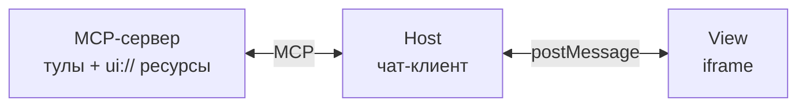
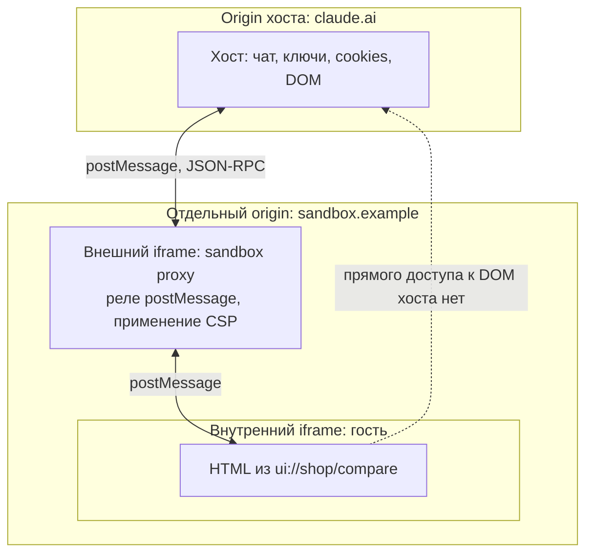
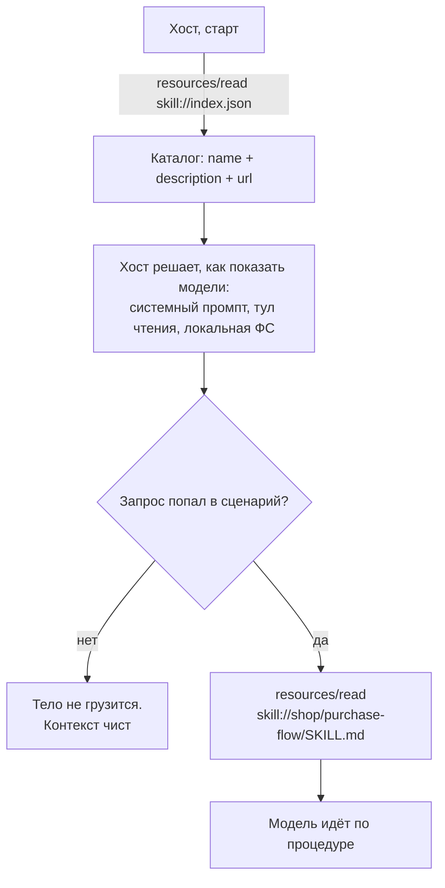
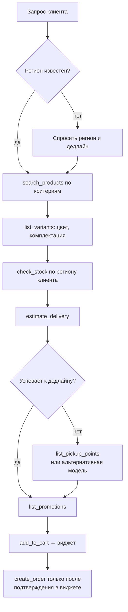

# Speech.md — раскадровка доклада

Формат: 30 минут. Slidev. Тайминг накопительный, старт от 00:00.
Статус: доклад собран целиком, 27 слайдов, два демо.

Легенда:
- **На слайде** — то, что видит зал.
- **Клики** — шаги Slidev (`<v-click>`, `<v-clicks>`, подсветка строк в код-блоке `{1|3-5|all}`).
- **Заметки спикера** — уходит в `<!-- ... -->` в конце слайда, видно в presenter mode.

---

# Блок 0. Агентский веб (00:00–05:00)

---

## Слайд 1. Титул

**00:00, 15 секунд**

**На слайде.** Название доклада. Имя, роль. QR или короткая ссылка на репозиторий с демо.

**Клики.** Нет.

**Заметки спикера.**

Пятнадцать секунд. Ссылку не проговаривать: она висит в углу весь доклад.

---

## Слайд 2. Ответ агента текстом (живое демо)

**00:15, 1 минута**

**На слайде.** Не слайд. Заранее открытый браузер: чат, подключённый к обычному MCP-серверу магазина. Без `ui://`, без `skill://`. Запрос набран заранее в поле ввода, отправляешь на месте.

Запрос: наушники для созвонов, до 15 тысяч, к пятнице.
Ответ: три абзаца текста с тремя моделями.

**Клики.** Кликов нет, работаешь в браузере. Возврат в Slidev после ответа.

**Заметки спикера.**

Реальный ответ на реальный запрос. Модели подобраны верно, цены названы верно, фактических ошибок в тексте нет.

Посмотрите, что человек делает дальше. Сравнить характеристики по трём абзацам он не может. Выбрать цвет тоже: про цвета агент не написал, в текст всё не влезает. Узнать, когда это приедет к нему в город, не может тем более.

Он открывает сайт магазина и проходит весь путь заново. Разговор с агентом сэкономил ему ноль.

Тридцать лет индустрия строила для человека интерфейсы прямого действия. Агенту мы выдали ленту строк и на этом остановились.

**Риск.** Живой браузер на первой минуте, когда зал ещё не на твоей стороне. Окно с ответом должно быть уже прогрето: запрос отправлен до выхода на сцену, вкладка открыта, ответ на экране. Отправляешь второй раз только если сеть ведёт себя. Скриншот того же ответа держать соседней вкладкой.

**Связка со слайдом 4.** Эта же вкладка живёт до слайда 4: там ты возвращаешься в неё и показываешь, что обещание доставки к пятнице неверное. Один непрерывный сюжет вместо двух отдельных картинок.

---

## Слайд 3. Контракт тула

**01:15, 1 минута 5 секунд**

**На слайде.** Слева три тула списком и многоточие:

```
search_products
get_product
list_variants
…
```

Справа раскрывается карточка одного тула целиком:

```json
{
  "name": "search_products",
  "title": "Поиск товаров",
  "description": "Поиск по каталогу: категория, цена, характеристики. Возвращает товары с ценой и рейтингом.",
  "inputSchema": {
    "type": "object",
    "properties": {
      "query":     { "type": "string",  "description": "Поисковый запрос" },
      "category":  { "type": "string",  "enum": ["headphones", "keyboards", "mice"] },
      "max_price": { "type": "integer", "description": "Максимальная цена, руб." }
    },
    "required": ["query"]
  },
  "annotations": { "readOnlyHint": true }
}
```

**Клики.**
1. Список слева.
2. Карточка справа целиком.
3. Подсветка `description`.
4. Подсветка `inputSchema`: типы, `enum`, `required`, описание каждого параметра.
5. Подсветка `annotations`.

**Заметки спикера.**

Сервер магазина. Тулов здесь двадцать, показываю три.

Раскрою один. `search_products`: имя, описание, `inputSchema` с типами, обязательными полями и описанием каждого параметра. Категория задана через `enum`, промахнуться нельзя. Аннотация говорит, что тул только читает и ничего не меняет.

Контракт оформлен по всем правилам. Тот, кто писал этот сервер, сделал свою работу хорошо. Плохой пример я специально не беру: на плохом примере доказывать нечего.

Модель это читает и понимает, что тул делает. Так и задумано, механизм работает.

Двадцать таких карточек приезжают агенту при подключении и лежат в контексте на каждом запросе, включая те, где про возвраты и промокоды никто не спрашивал.

---

## Слайд 4. Провальный прогон

**02:20, 55 секунд**

**На слайде.** Лог прогона: запрос клиента, вызов `search_products`, ответ агента с обещанием доставки к пятнице. Ниже — реальные данные: остатка в регионе нет, срок девять дней.

**Клики.**
1. Запрос клиента.
2. Вызов `search_products` и ответ агента.
3. Красным: остаток по региону, реальный срок девять дней.
4. Строка внизу: «вызов валиден, схема соблюдена, ответ неверный».

**Заметки спикера.**

Запрос: наушники для созвонов, до пятнадцати тысяч, к пятнице.

Агент зовёт `search_products`, берёт первую модель по рейтингу и обещает доставку к пятнице.

Пауза после третьего клика. Дать залу увидеть самому.

Остатка этой модели в регионе клиента нет. Реальный срок — девять дней. `estimate_delivery` агент не позвал ни разу.

Схема соблюдена. Вызов валидный. Ответ неверный.

---

## Слайд 5. Граница ответственности

**03:15, 1 минута**

**На слайде.** Слева карточка `estimate_delivery` с пометкой «написано правильно». Справа три вопроса, на которые она не отвечает.

**Клики.**
1. Слева: карточка `estimate_delivery`.
2. Справа: «в каком порядке звать эти шесть тулов?»
3. Справа: «что делать, если товара нет на локальном складе?»
4. Справа: «рейтинг — это критерий выбора?»
5. Внизу: «схема отвечает на вопрос, что делает этот тул».

**Заметки спикера.**

Карточка `estimate_delivery` написана правильно, я её показывал минуту назад. Агент до неё не дошёл.

Знание, которого ему не хватило, звучит так: прежде чем называть срок, проверь остаток на складе в регионе клиента. Это знание не про вызов одного тула. Оно про порядок работы с шестью.

В схеме для него нет места. Схема отвечает на вопрос «что делает этот тул». На вопросы «в каком порядке их звать» и «что делать, если товара нет на локальном складе» она не отвечает, и отвечать не должна.

Сразу оговорюсь, чтобы снять вопрос из зала. Скилл не чинит кривой API. Если порядок вызовов обязателен и выражается схемой, выражайте схемой: обязательным полем, проверкой внутри тула, внятной ошибкой. Речь про знание, которое в схему не кладётся по своей природе: критерии выбора, что уточнить у клиента, границы обещаний.

---

## Слайд 6. Два ресурса

**04:15, 45 секунд**

**На слайде.** Разворот. Слева `ui://` — интерфейс для человека. Справа `skill://` — инструкция для агента. Внизу: и то и другое — `resources` в MCP.

**Клики.**
1. Левая половина.
2. Правая половина.
3. Нижняя строка.

**Заметки спикера.**

Дыры две, и они симметричны. Человек получил ответ и не может ничего с ним сделать. Агент получил список тулов и не знает, в каком порядке их звать.

Закрываются они двумя ресурсами. `ui://` — интерфейс для человека. `skill://` — инструкция для агента.

Оба — обычные resources в MCP. Новых примитивов нет, ядро протокола никто не трогает.

Рабочая группа Skills Over MCP формулирует это так: скиллы — это контекст, а MCP — протокол контекста. Агент уже ходит на сервер за тулами. За инструкцией он может ходить туда же.

К этому слайду я вернусь в конце.

---

# Блок 1. `ui://` (05:00–13:30)

## Слайд 7. Три участника и жизненный цикл

**05:00, 1 минута 10 секунд**

**На слайде.** Простая схема из трёх боксов, читаемая с последнего ряда.



Справа от схемы — четыре фазы текстом, появляются по кликам.

**Клики.**
1. Схема из трёх боксов.
2. Фаза 1: подключение. Хост забирает HTML-шаблон.
3. Фаза 2: вызов. Модель зовёт тул, сервер отдаёт результат.
4. Фаза 3: рендер. Хост поднимает iframe, отдаёт тему, размеры, аргументы и результат.
5. Фаза 4: интерактив. Виджет зовёт тулы обратно через хост.

**Заметки спикера.**

Три участника.

Сервер объявляет тулы и UI-ресурсы. Хост — это чат-клиент: он держит iframe и проксирует всё, что происходит между сервером и виджетом. View — сам виджет, живущий внутри iframe.

Сервер и хост говорят по MCP. Хост и View — через postMessage. Прямого канала между сервером и виджетом нет, и это важная деталь, к ней я вернусь на слайде про песочницу.

Жизненный цикл в четыре фазы.

При подключении хост забирает у сервера HTML-шаблон. До любого вызова тула, заранее.

Пользователь спрашивает, модель зовёт тул, сервер возвращает результат.

Хост поднимает iframe, отдаёт ему тему и размеры контейнера, потом присылает аргументы тула и его результат.

Пользователь работает с виджетом. Виджет может позвать тул обратно, через хост.

Перед тем как убрать виджет с экрана, хост его предупреждает: можно сохранить состояние.

---

## Слайд 8. UI-ресурс объявлен заранее

**06:05, 45 секунд**

**На слайде.** Сверху четыре пункта: что даёт предобъявление. Снизу три отвергнутых варианта.

**Клики.**
1. Что даёт: префетч, кеш, ревью HTML до исполнения, разделение статичной разметки и динамических данных.
2. Отвергнутый вариант: embedded resources.
3. Отвергнутый вариант: глобальный объект API.
4. Отвергнутый вариант: внешние URL.

**Заметки спикера.**

Шаблон приезжает при подключении. Хост может его закешировать, отревьюить и подготовить заранее. Статичная разметка не смешивается с динамическими данными.

Три варианта авторы рассмотрели и отклонили. Это ответ на вопрос «почему не проще».

Первый: возвращать UI прямо в результате тула, как делает mcp-ui сегодня. Сервер писать удобнее, зато хост не успевает отревьюить HTML до исполнения, и кешировать нечего.

Второй: положить в iframe глобальный объект API. Отклонили: хосту пришлось бы инжектить свой код в каждый фрейм, а с внешними источниками это не работает.

Третий: разрешить внешние URL. Отложили: модель не видит содержимое такой страницы, скриншот не снять, ревью не провести. Могут вернуть отдельной capability.

---

## Слайд 9. `content` и `structuredContent`

**06:50, 50 секунд**

**На слайде.** Результат тула расходится на две ветки: `content` уходит в контекст модели, `structuredContent` уходит в виджет.

**Клики.**
1. Результат тула.
2. Ветка `content`: три строки текста → контекст модели.
3. Ветка `structuredContent`: двадцать моделей с характеристиками, вариантами, остатками, сроками → виджет.
4. Подпись: контекст модели не раздувается, пользователь видит таблицу.

**Заметки спикера.**

Результат тула едет двумя потоками.

`content` — текст, который попадает в контекст модели.

`structuredContent` — данные, которые попадают в виджет.

В магазине это развязывает главный узел. Двадцать моделей с характеристиками, вариантами, остатками по складам и сроками доставки уходят в `structuredContent`. Пользователь видит таблицу и сравнивает. Модель получает три строки текста и не платит контекстом за то, чего ей знать не нужно.

---

## Слайд 10. Обратный канал и `visibility`

**07:45, 55 секунд**

**На слайде.** Сверху: JSON-RPC 2.0 поверх `postMessage`, стрелка от виджета через хост к серверу. Снизу — `visibility`.

```json
{ "name": "refresh_delivery", "visibility": ["app"] }
```

**Клики.**
1. Схема обратного канала: виджет → хост → сервер.
2. Подпись: каждый вызов логируется, хост может требовать подтверждения.
3. `visibility` по умолчанию: `["model", "app"]`.
4. `visibility: ["app"]`, подсветка.
5. Примеры: кнопка «обновить срок», пагинация, переключение варианта.

**Заметки спикера.**

Виджет говорит с хостом через JSON-RPC поверх postMessage. Свой формат сообщений авторы не изобретали: у mcp-ui были типы `tool`, `prompt`, `intent`, их свели к подмножеству обычного JSON-RPC. Каждый вызов из виджета логируется, проходит через хост, и хост может потребовать подтверждения у пользователя.

Дальше деталь, которую мало кто знает.

У тула есть поле `visibility`. По умолчанию `["model", "app"]`. Если поставить `["app"]`, модель этот тул не увидит вообще.

Кнопка «обновить срок доставки», пагинация в списке сравнения, переключение варианта: виджет зовёт эти тулы сам, контекст модели остаётся чистым.

---

## Слайд 11. Код

**08:35, 35 секунд**

**На слайде.** Два JSON-объекта.

```json
{
  "uri": "ui://shop/compare",
  "name": "Сравнение наушников",
  "mimeType": "text/html;profile=mcp-app"
}

{
  "name": "compare_products",
  "inputSchema": { "type": "object", "properties": { "product_ids": {} } },
  "_meta": { "ui": { "resourceUri": "ui://shop/compare" } }
}
```

**Клики.** Подсветка строк код-блока: `{1-5|7-11|10|all}`.
1. Объявление UI-ресурса.
2. Тул.
3. Строка `_meta`.
4. Всё вместе.

**Заметки спикера.**

Весь диф сервера.

Объявляем ресурс: URI со схемой `ui://`, имя, MIME-тип.

Тул ссылается на ресурс через `_meta`.

Всё. Внутри iframe обычный HTML. Тему и размеры контейнера хост отдаст сам при инициализации.

Свериться перед докладом. `mimeType` — `text/html;profile=mcp-app`; в ноябрьском анонсе был `text/html+mcp`. `_meta` — вложенный объект `{ "ui": { "resourceUri": ... } }`; в ноябрьском анонсе был плоский ключ `"ui/resourceUri"`. Источник истины: `modelcontextprotocol/ext-apps`, каталог `specification/2026-01-26/`. Сейчас в статусе release candidate висит спека 2026-07-28.

---

# Демо 1. `ui://` живьём (09:10–11:40)

Слайд-заглушка «DEMO» или сразу шаринг экрана. Возврат в ту же вкладку, где на слайде 2 был текстовый ответ.

Пять тактов, 2 минуты 30 секунд. Ниже — что делаешь и что говоришь.

---

### Такт 1. Тот же запрос, другой ответ

**09:10, 20 секунд**

Тот же сервер, тот же запрос. Разница одна: хост согласовал расширение MCP Apps, и тул `compare_products` теперь ссылается на `ui://shop/compare`.

Вместо трёх абзацев в чате рисуются карточки сравнения: три модели, характеристики в строках, вариант, цена, срок доставки.

**Говоришь.**

Тот же самый сервер. Тот же самый запрос. Я добавил один ресурс и одну строку в метаданные тула.

---

### Такт 2. Взаимодействие без модели

**09:30, 30 секунд**

Переключаешь вариант: цвет, комплектация. Карточки пересчитываются. Рядом открыт лог: обращений к модели нет ни одного.

**Говоришь.**

Я переключаю комплектацию. Данные пересчитались, к модели никто не обращался, токены не потрачены.

Это тот самый `visibility: ["app"]`, который я показывал минуту назад. Тул `select_variant` объявлен видимым только приложению. Модель про него не знает и знать не должна: переключение цвета не событие для контекста разговора.

В текстовом чате каждое такое движение стоило бы полного круга через модель.

---

### Такт 3. Срок доставки под регион

**10:00, 30 секунд**

В карточке виден срок доставки в регион клиента. Жмёшь «обновить срок» — виджет зовёт `refresh_delivery`, срок пересчитывается.

**Говоришь.**

Срок доставки виджет показывает для региона клиента, а не для склада по умолчанию.

Данные для этого приехали в `structuredContent`: остатки по всем складам, сроки, варианты. В контекст модели ушло три строки текста. Пользователь видит таблицу, модель не платит за неё контекстом.

---

### Такт 4. Действие и подтверждение

**10:30, 40 секунд**

Жмёшь «в корзину». Хост выкидывает диалог подтверждения. Подтверждаешь. В логе — `tools/call add_to_cart`.

**Говоришь.**

Нажатие в чужом HTML не кладёт товар в корзину. Оно просит хост положить товар в корзину.

Виджет отправил JSON-RPC сообщение через postMessage. Хост его получил, показал мне запрос на подтверждение и только после моего согласия вызвал тул на сервере. Сам виджет в сеть не ходил и не мог.

Модель при этом осталась в петле: она видит результат вызова и продолжает разговор.

---

### Такт 5. Что под капотом

**11:10, 30 секунд**

Открываешь DevTools, вкладка Elements. Показываешь дерево: внешний фрейм на отдельном origin, внутри него гостевой фрейм с HTML виджета. Затем консоль с логом postMessage.

**Говоришь.**

Загляну под капот.

Вот дерево элементов. Обратите внимание: фреймов два. Внешний, на отдельном домене, и внутри него второй, с нашим HTML.

Вот сообщения между ними: обычный JSON-RPC, тот же протокол, что и везде в MCP. Каждое хост может залогировать, показать пользователю и отклонить.

Два фрейма вместо одного — не случайность и не перестраховка автора хоста. Сейчас покажу, откуда они берутся.

**Смысл такта.** Он ставит вопрос, на который отвечают следующие два слайда. Отвечать здесь не надо.

---

### Риски и запасной путь

Живой вызов к MCP-серверу — самая вероятная точка отказа. Видео всех пяти тактов записать заранее, держать в соседней вкладке, переключаться без объяснений.

DevTools в такте 5 открывать заранее, до выхода на сцену: искать вкладку Elements под взглядом зала — верный способ потерять тридцать секунд.

Если время поджимает, такт 3 убирается целиком. Такт 5 не убирается: с него начинается разговор про песочницу.

---

## Слайд 12. Границы

**11:40, 35 секунд**

**На слайде.** Пять строк, по одной на клик. Внизу — крючок на следующий слайд.

**Клики.** `<v-clicks>`:
1. Виджет живёт в sandboxed iframe: ни DOM хоста, ни cookies, ни storage.
2. Сети у виджета нет по умолчанию. Домены декларируются в CSP-метаданных, хост их применяет.
3. Связь только через `postMessage`, аудируемыми JSON-RPC сообщениями.
4. Хост может требовать подтверждения на любой вызов тула из виджета.
5. Хосты без расширения показывают обычный текст.
6. Крючок: «два фрейма из DevTools — сейчас разберём, откуда они».

**Заметки спикера.**

Пять правил, быстро, без разбора.

Виджет живёт в sandboxed iframe: ни DOM хоста, ни его cookies, ни storage.

Сети у виджета нет по умолчанию. Сервер декларирует домены в CSP-метаданных, хост их применяет. Ничего не задекларировал — исходящих соединений не будет.

Связь только через postMessage, аудируемыми сообщениями. Вы их только что видели в консоли.

Хост может требовать подтверждения на любой вызов тула из виджета. Диалог, который выскочил на «в корзину», — это оно.

Хосты без расширения покажут обычный текст. Текстовый фолбэк пишется в сервере с первого дня, а не откладывается на потом.

Пункт первый я и разберу: sandboxed iframe, которых оказалось два.

---

## Слайд 13. Почему iframe в iframe

**12:15, 1 минута 15 секунд**

**На слайде.** Сверху условие: HTML приезжает строкой, а не ссылкой. Таблица вилки по `sandbox`. Снизу схема двух фреймов.

| Флаги | Что получаем |
|---|---|
| без `allow-scripts` | виджет мёртв: ни JS, ни интерактивности |
| `allow-scripts` + `allow-same-origin` | песочницы нет: origin хоста, `parent.document`, cookies, `localStorage`. Скрипт снимает `sandbox` с себя в родительском DOM и перезагружается без ограничений |
| `allow-scripts` без `allow-same-origin` | безопасно, но opaque origin: ни storage, ни cookies, ни однооригинных запросов |



**Клики.**
1. Условие: HTML приезжает строкой. `srcdoc` или blob-URL, оба наследуют origin родителя.
2. Строка таблицы: без `allow-scripts`.
3. Строка таблицы: `allow-scripts` + `allow-same-origin`. Красным.
4. Строка таблицы: `allow-scripts` без `allow-same-origin`.
5. Вывод: нужен другой origin.
6. Схема двух фреймов.

**Заметки спикера.**

HTML приезжает по MCP строкой, а не ссылкой. Отрисовать строку можно через `srcdoc` или blob-URL. Оба наследуют origin родителя, то есть origin самого хоста. Origin — это источник: схема, домен, порт.

Дальше вилка по атрибуту `sandbox`, и обе ветки плохие.

Убираем `allow-scripts` — виджет мёртв. Ни JS, ни интерактивности, показывать нечего.

Ставим `allow-scripts` вместе с `allow-same-origin` — песочницы больше нет. Скрипт внутри фрейма получает origin хоста: `parent.document`, cookies, `localStorage`. Он снимает атрибут `sandbox` с самого себя в родительском DOM и перезагружается уже без ограничений. Это записано прямым предупреждением в спецификации HTML и в MDN.

Ставим `allow-scripts` без `allow-same-origin` — безопасно, но фрейм получает opaque origin, непрозрачный. Ни storage, ни cookies, ни однооригинных запросов. Половина фронтенд-кода на этом ломается.

Выход один: увести гостя на другой origin. Тогда `allow-same-origin` можно давать спокойно, потому что «свой origin» для гостя — домен песочницы, а не домен хоста. Гость получает рабочий storage, и хосту это не стоит ничего.

Другой origin нужно чем-то создать. Отсюда внешний фрейм, загруженный с отдельного домена, а внутри него гостевой фрейм с нашим HTML.

Внешний фрейм даёт три вещи. Границу origin. Применение CSP по метаданным ресурса, включая список разрешённых доменов. Нормализацию JSON-RPC до того, как сообщение дойдёт до хоста.

Гость хоста не видит. Он видит прокси.

Про точность формулировок. Спека требует sandboxed iframe с ограниченными правами, аудируемых JSON-RPC сообщений и применения CSP по метаданным ресурса. Двойной фрейм — это то, как хосты выполняют требование; у MCPJam Inspector он задокументирован именно так. Говорить «хосты делают вложенный фрейм, и вот причина», не «спека требует».

Возврат к демо: те два фрейма, которые вы видели в DevTools, — это внешний прокси и гость. Одним iframe безопасно не получается.

---

# Блок 2. `skill://` (13:30–19:30)

---

## Слайд 14. Куда положить процедуру

**13:30, 50 секунд**

**На слайде.** Возврат к вопросам со слайда 5. Под ними — два наивных решения, каждое перечёркивается.

**Клики.**
1. Вопросы со слайда 5, бледным: в каком порядке звать тулы, что делать, если товара нет.
2. Решение первое: написать это в `description` тула. Перечёркивается.
3. Решение второе: написать в `instructions` сервера. Перечёркивается.

**Заметки спикера.**

Знание есть, места для него нет. Разберём два очевидных варианта, куда его положить.

Первый: написать в `description`. В `description` какого тула? Правило «проверь остаток, прежде чем называть срок» не про `estimate_delivery` и не про `check_stock`. Оно про связку между ними. Поле принадлежит одному тулу, а знание живёт между шестью.

Второй: написать в `instructions` сервера. Инструкции сервера грузятся один раз, при инициализации. Обновил процедуру — переподключай сервер. И размер: моя процедура для магазина занимает сто сорок строк. В инструкции сервера её никто не положит.

Оба варианта платят одним и тем же: текст висит в контексте постоянно, для всех запросов, включая те, где он не нужен.

---

## Слайд 15. Четыре ограничения

**14:20, 1 минута**

**На слайде.** Четыре пункта, выписанные рабочей группой Skills Over MCP. Заголовок: «почему не хватает того, что есть».

**Клики.** `<v-clicks>`:
1. Инструкции сервера грузятся только на инициализации. Новый или обновлённый скилл требует переподключения.
2. Сложные процедуры не влезают в разумный размер инструкции. Сотни строк markdown со ссылками на приложенные файлы.
3. Нет discovery. Пользователь ставит сервер и не знает, что к нему есть скилл, который надо поставить отдельно.
4. Оркестрация через несколько серверов. Скиллу может понадобиться скоординировать тулы с разных серверов.

**Заметки спикера.**

Это не мой список. Так рабочая группа Skills Over MCP формулирует проблему в своём репозитории.

Первое. Инструкции сервера приезжают один раз, на инициализации. Обновил процедуру — переподключайся.

Второе. Сложные процедуры не влезают в разумный размер инструкции. Речь про сотни строк markdown, которые ещё и ссылаются на приложенные файлы.

Третье. Discovery нет вообще. Человек ставит MCP-сервер и не знает, что к нему существует скилл, который надо поставить отдельно, из другого места.

Четвёртое, и на нём я остановлюсь. Скиллу может понадобиться скоординировать тулы с нескольких серверов. Магазин, служба доставки, платёжный провайдер. Ни одно поле `description` этого не выразит по определению: оно принадлежит одному тулу на одном сервере.

Формулировка рабочей группы: описание тула говорит агенту, что тул делает. Оно не говорит, как оркестрировать несколько тулов ради цели.

---

## Слайд 16. Анатомия скилла

**15:20, 50 секунд**

**На слайде.** Дерево директории слева, прогрессивное раскрытие справа.

```
purchase-flow/
├── SKILL.md          ← фронтматтер + процедура
├── references/
│   └── delivery-rules.md
├── examples/
│   └── out-of-stock.md
└── scripts/          ← в MCP не исполняются
```

**Клики.**
1. Дерево директории.
2. Фронтматтер `SKILL.md`: `name`, `description`.
3. Справа: в контексте модели постоянно висят только `name` и `description`.
4. Справа: тело приезжает при попадании в сценарий.

**Заметки спикера.**

Скилл — это директория. `SKILL.md` с YAML-фронтматтером обязателен, рядом могут лежать справочники, примеры, скрипты.

Формат придумали не в MCP. Спека Agent Skills уже описывает фронтматтер, правила именования, соглашения по директориям и модель прогрессивного раскрытия. MCP работает транспортом и в содержимое не лезет.

Прогрессивное раскрытие — модель постоянно видит короткую аннотацию, а полный текст читает при попадании в сценарий. В контексте висят имя и описание, две строки. Сто сорок строк процедуры приезжают тогда, когда клиент действительно пришёл за наушниками.

Про `scripts/` скажу отдельно на последнем слайде блока.

---

## Слайд 17. Как хост находит и грузит

**16:10, 1 минута**

**На слайде.** Схема discovery.



**Клики.**
1. Хост тянет `index.json` при старте.
2. Хост решает, как показать метаданные модели.
3. Ветка «не попал» — тело не грузится.
4. Ветка «попал» — `resources/read` тела.
5. Оговорка внизу: `index.json` не обязателен.

**Заметки спикера.**

Discovery ведёт хост, не модель. На старте он тянет `index.json` со всех подключённых серверов и получает каталог: имя, описание, где лежит.

Дальше хост сам решает, как показать это модели. Вариантов три: инжектнуть метаданные в системный промпт, дать модели тул чтения ресурса, или записать скиллы в локальную файловую систему. Прототип для Claude Code делает первое. Спека сознательно не требует файловой системы, чтобы хосты без неё тоже могли участвовать.

Теперь оговорка, которую я сам сначала понял неправильно. `index.json` не обязателен. Базовый механизм — прямая читаемость: URI скилла всегда валидный аргумент `resources/read`. Каталог — надстройка для тех серверов, где перечисление вообще имеет смысл.

Оно имеет смысл не везде. Документационный сервер, который синтезирует скилл на каждый эндпоинт, отдаст тысячи. Шлюз поверх внешнего индекса не знает границ. Сервер, генерирующий скиллы из шаблонов, перечислить их не может в принципе.

Отсюда требование к хосту: пустое перечисление не считается доказательством отсутствия скиллов.

---

## Слайд 18. Процедура для магазина

**17:10, 1 минута**

**На слайде.** Схема процедуры.



**Клики.**
1. Ветка уточнений: регион и дедлайн.
2. Подбор: `search_products`, `list_variants`.
3. Красным: `check_stock` перед `estimate_delivery`. Тот самый шаг, которого не хватило.
4. Развилка по дедлайну и ветка «не успеваем».
5. Хвост: виджет и `create_order`.

**Заметки спикера.**

Вот процедура, которой не хватило агенту на четвёртом слайде.

Регион и дедлайн спрашиваются до подбора. Наушники к пятнице в Москве и в Иркутске — разные наушники.

`check_stock` вызывается до `estimate_delivery`, всегда. Без него `estimate_delivery` вернёт срок склада по умолчанию, и агент пообещает пятницу. Ровно это вы видели.

Ветка «не успеваем» не молчит и не подбирает заново втихую. Она показывает пункт выдачи, если он ближе по сроку, или предлагает модель того же назначения с локального склада, и называет разницу вслух.

Последний шаг — ссылка из скилла на виджет. `create_order` вызывается после того, как человек нажал кнопку. Две половины доклада здесь сходятся: скилл учит агента довести до виджета, виджет спрашивает человека.

---

## Слайд 19. Код

**18:10, 50 секунд**

**На слайде.** `SKILL.md` (фрагмент), `index.json`, и три строки регистрации на сервере.

```markdown
---
name: purchase-flow
description: Подбор товара и оформление заказа с проверкой сроков доставки.
---

## Порядок
3. check_stock с регионом клиента. Обязательно до шага 4.
4. estimate_delivery. Без шага 3 вернёт срок склада по умолчанию — ошибка.
5. Не успеваем к дедлайну → list_pickup_points либо альтернатива
   с локального склада. Разницу назвать вслух.

## Чего не делать
- Не называть срок доставки без check_stock.
- Не выдавать рейтинг за критерий подбора.
- Не обещать срок как гарантию: это оценка перевозчика.
```

```json
{
  "skills": [
    {
      "name": "purchase-flow",
      "description": "Подбор товара и оформление заказа",
      "url": "skill://shop/purchase-flow/SKILL.md",
      "type": "skill-md"
    }
  ]
}
```

**Клики.**
1. Фронтматтер `SKILL.md`.
2. Шаги 3–5, подсветка.
3. Раздел «чего не делать».
4. `index.json`.
5. Скролл: показать, что файл длиной сто сорок строк, а на слайде десять.

**Заметки спикера.**

Фронтматтер: имя и описание. Эти две строки висят в контексте модели, остальное грузится по требованию.

Дальше процедура. Пункт четвёртый — ядро всего демо. Он объясняет, почему агент промахнулся, притом что все описания тулов написаны правильно.

Раздел «чего не делать» работает не хуже раздела «что делать». Рейтинг — справка, а не критерий подбора. Срок — оценка перевозчика, а не гарантия.

Каталог: имя, описание, где лежит тело.

На сервере это регистрируется как обычный ресурс. В FastMCP скилл вешается декоратором `@mcp.resource()` под своим URI, и всё. Так сделан, например, скилл IPInfo: `skill://ipinfo/usage`, а в инструкциях сервера написано прочитать его прежде, чем звать тулы.

Прокручиваю. Здесь сто сорок строк. Никто и никогда не положит их в `description`.

---

## Слайд 20. Границы

**19:00, 30 секунд**

**На слайде.** Три пункта.

**Клики.** `<v-clicks>`:
1. Скиллы поверх MCP — только инструктор. Скилл, исполняющий код, выведен за скобки.
2. Многофайловые скиллы едут архивом (zip, tar), а не пофайловым `resources/read`.
3. Хост не исполняет ничего локально из содержимого скилла без явного согласия.

**Заметки спикера.**

Три границы, быстро.

Область применения: только инструктор. Скилл, который учит агента текстом. Скилл-хелпер, исполняющий код на машине пользователя, рабочая группа вывела за скобки решением от четырнадцатого февраля.

Многофайловые скиллы едут архивом, целиком, а не по одному файлу через `resources/read`.

Скрипты из скилла, приехавшего по MCP, хост локально не исполняет без явного согласия пользователя. Ни хуков, ни pre- и post-скриптов, ни шелл-команд во фронтматтере. Microsoft в своей реализации пошла дальше: скрипты из архивных скиллов не исполняются никогда.

---

# Демо 2. `skill://` живьём (19:30–22:00)

Возврат в ту же вкладку. Рядом открыт лог вызовов — он здесь главный экран, чат вторичен.

Пять тактов, 2 минуты 30 секунд.

---

### Такт 1. Что изменилось на сервере

**19:30, 25 секунд**

Показываешь `index.json` и дерево скилла на сервере. Показываешь `tools/list`: тот же самый, двадцать тулов, ни одного нового.

**Говоришь.**

Я добавил на сервер один каталог и один markdown-файл.

Тулы не менялись. Ни одного нового, ни одного переписанного описания. Вот `tools/list`, он тот же, что вы видели на третьей минуте.

---

### Такт 2. Тот же запрос

**19:55, 45 секунд**

Отправляешь тот же запрос: наушники для созвонов, до 15 тысяч, к пятнице. В логе крупно проступает цепочка:

```
resources/read  skill://index.json
resources/read  skill://shop/purchase-flow/SKILL.md
tools/call      search_products
tools/call      list_variants
tools/call      check_stock      ← регион клиента
tools/call      estimate_delivery
tools/call      list_pickup_points
```

Агент отвечает: к пятнице эта модель не успевает, девять дней. Предлагает пункт выдачи в двух остановках или другую модель с локального склада.

**Говоришь.**

Смотрите на лог, а не на чат.

Агент прочитал каталог. Нашёл скилл, который подходит под запрос. Прочитал тело.

Дальше он идёт по процедуре. Ищет. Раскрывает варианты. Проверяет остаток — по региону клиента, а не по складу по умолчанию. И только теперь спрашивает срок.

Срок — девять дней. К пятнице не успевает. Агент это видит и уходит в ветку, которую я ему написал: пункт выдачи или альтернатива с локального склада.

Тот же вопрос. Тот же сервер. Другой ответ.

---

### Такт 3. Два лога рядом

**20:40, 25 секунд**

Делишь экран: слева лог первого прогона (один вызов), справа лог второго (шесть вызовов в правильном порядке).

**Говоришь.**

Слева — то, что было в начале доклада. Один вызов, и обещание, которое магазин не сдержит.

Справа — шесть вызовов в правильном порядке.

Разница между этими двумя логами — сто сорок строк markdown, лежащие на сервере рядом с тулами.

---

### Такт 4. Правка на живом сервере

**21:05, 35 секунд**

Открываешь `SKILL.md`, дописываешь правило: при дедлайне меньше трёх дней сразу показывай пункты выдачи, не предлагая доставку. Сохраняешь. Отправляешь новый запрос: «наушники к завтрашнему дню».

Агент показывает пункты выдачи сразу, доставку не предлагает.

**Говоришь.**

Правлю процедуру на сервере. Сохраняю.

Сервер я не перезапускал. Клиент не переподключался.

Следующий запрос — и агент ведёт себя по новому правилу.

Вот это `description` не может физически. Описания тулов приезжают один раз, при инициализации. Ресурс читается тогда, когда он нужен.

**Если не готово к докладу.** Такт убирается целиком, а мысль переносится в слайд 15, первым пунктом четырёх ограничений. Терять её нельзя: это единственная вещь, которую не подделать хорошим описанием.

---

### Такт 5. Две половины сходятся

**21:40, 20 секунд**

Агент доводит до виджета. Виджет показывает пункты выдачи с картой. Жмёшь «оформить» — хост спрашивает подтверждение.

**Говоришь.**

Последний шаг процедуры — довести человека до виджета.

Скилл научил агента, что делать. Виджет спросил человека, согласен ли он.

Один сервер, два ресурса, обе аудитории.

---

### Риски и запасной путь

**Провал без скилла должен воспроизводиться.** Если агент промахивается через раз, промпт не подкручивать. Сказать со сцены: «промахивается часто, не каждый раз», показать оба прогона. Недетерминированность скиллов — часть картины, и в блоке про историю ты про неё скажешь сам.

**Скилл может не сработать.** Рабочая группа на своих прогонах видела, как агент игнорирует доступный скилл и лезет прямо в тулы. Помогает `instructions` сервера со строкой «сначала прочитай скилл» — прописать её заранее и не полагаться на удачу.

**Лог — главный экран.** Настроить его читаемым с последнего ряда до выхода на сцену: крупный шрифт, подсветка строк `resources/read`.

Видео всех пяти тактов записать заранее.

---

# Блок 3. История и развитие (22:00–25:30)

---

## Слайд 21. Осень 2025: развилка

**22:00, 55 секунд**

**На слайде.** Две ветки, расходящиеся от MCP. Слева mcp-ui, справа OpenAI Apps SDK. Внизу — разработчик, который пишет адаптеры под оба.

**Клики.**
1. Слева: mcp-ui. Ido Salomon, Liad Yosef. Своя схема сообщений, UI приезжает в результате тула.
2. Список принявших: Postman, Shopify, Hugging Face, Goose, ElevenLabs.
3. Справа: 6 октября 2025, DevDay. OpenAI Apps SDK. Тот же MCP под капотом, своя реализация.
4. Внизу: два несовместимых способа делать одно и то же.

**Заметки спикера.**

Осенью прошлого года двое разработчиков, Идо Саломон и Лиад Йосеф, сделали mcp-ui. Сообщество, свой протокол сообщений, UI приезжает прямо в результате тула. Проект взлетел: Postman, Shopify, Hugging Face, Goose, ElevenLabs.

Шестого октября OpenAI на DevDay показывает Apps SDK. Под капотом тот же MCP, реализация своя.

Дальше знакомая картина. Два несовместимых способа сделать одно и то же, и разработчик сервера пишет адаптеры под каждый хост.

Здесь могу признаться. Свой первый MCP-сервер я собрал на сорок тулов и был уверен, что подробные описания закрывают вопрос. Собственно, поэтому доклад и начинается с того слайда.

---

## Слайд 22. Слияние

**22:55, 55 секунд**

**На слайде.** Две ветки сходятся в одну. Даты и имена.

**Клики.**
1. 21 ноября 2025: SEP-1865. Авторы с обеих сторон, плюс мейнтейнеры mcp-ui.
2. Ключевые решения спеки: предобъявленный ресурс, JSON-RPC вместо своего формата, обязательный sandbox.
3. 26 января 2026: первое официальное расширение MCP. Идентификатор `io.modelcontextprotocol/ui`.
4. Где работает: ChatGPT, Claude, VS Code, Goose.

**Заметки спикера.**

Двадцать первого ноября случается то, чего в такой ситуации обычно не случается. Anthropic, OpenAI и мейнтейнеры mcp-ui садятся вместе и публикуют SEP-1865. Не «мы сделали свой стандарт», а слияние двух живых экосистем в одну спеку.

В авторах — core-мейнтейнеры MCP из OpenAI и из Anthropic, и оба автора mcp-ui.

Ключевые решения вы уже видели. Ресурс объявляется заранее, а не приезжает в результате тула. Свой формат сообщений выбросили в пользу обычного JSON-RPC. Песочница обязательна.

Двадцать шестого января MCP Apps выезжает как первое официальное расширение MCP. Идентификатор `io.modelcontextprotocol/ui`. Рендерят ChatGPT, Claude, VS Code, Goose.

mcp-ui при этом никуда не делся: он остался рекомендованным клиентским SDK.

---

## Слайд 23. Спор про скиллы

**23:50, 1 минута**

**На слайде.** Две ветки: SEP-2076 и SEP-2640. Аргументы каждой.

**Клики.**
1. SEP-2076: скиллы — первоклассный примитив. `skills/list`, `skills/get`, свои capabilities.
2. Аргумент за: ресурсы по умолчанию application-controlled, решение читать принимает хост. Скилл, учащий агента, model-controlled по природе.
3. SEP-2640: расширение поверх Resources. Ядро протокола не трогаем.
4. Победила вторая линия. PR-2076 закрыт.
5. Размен: активацию скиллов это не решило.

**Заметки спикера.**

Со скиллами история другая, и в ней был настоящий спор. Расскажу, потому что он объясняет, почему у скиллов до сих пор шероховато.

Первое предложение, SEP-2076: сделать скиллы полноценным примитивом. Свои методы `skills/list` и `skills/get`, свои capabilities, всё как у тулов.

Аргумент за это был сильный. Ресурсы в MCP по умолчанию application-controlled: решение прочитать ресурс принимает хост. А скилл, который учит агента оркестрировать тулы, по своей природе model-controlled — агент должен сам решить, что ему нужна инструкция.

Победила другая линия, SEP-2640: расширение поверх Resources. Ядро протокола не трогаем, любой существующий сервер апгрейдится за вечер.

Что мы за это отдали. Проблему активации так и не решили. Модель не выбирает скилл сама, за неё это делает хост.

---

## Слайд 24. Что не работает и где мы сейчас

**24:50, 40 секунд**

**На слайде.** Слева: что не работает. Справа: кто уже сделал. Внизу: статус.

**Клики.**
1. Модели ленивы: агент игнорирует скилл, идёт в тулы, падает, потом читает.
2. Кто уже сделал: FastMCP 3.0, Microsoft Agent Framework, GitHub MCP Server, Mintlify, Apify. Прототипы хостов: gemini-cli, fast-agent, goose, codex, Claude Code.
3. Статус: Apps — продакшен с 26 января. Skills — SEP-2640, pending.

**Заметки спикера.**

Честно про то, что не работает.

Боб Дикинсон на своём инструменте наблюдал: агент видит доступный скилл, игнорирует его и лезет прямо в тулы. Падает несколько раз. И только потом читает инструкцию. Помогла строка в `instructions` сервера: сначала прочитай скилл.

При этом скиллы поверх MCP — не бумага. FastMCP отдаёт их штатно. Microsoft встроила в Agent Framework, для .NET и Python. GitHub MCP Server подтягивает скиллы из репозиториев. Mintlify отдаёт их и через `.well-known`, и как MCP-ресурсы. Прототипы хостов есть в gemini-cli, goose, codex, Claude Code.

Статус на сегодня. MCP Apps — продакшен, работает с двадцать шестого января. Skills over MCP — SEP-2640, всё ещё pending.

Половина моего доклада — то, что можно катить завтра. Половина — то, за чем надо следить.

---

# Блок 4. Новая реальность (25:30–28:00)

---

## Слайд 25. Что чем закрывать

**25:30, 1 минута**

**На слайде.** Таблица решений. Три строки.

| Что нужно | Чем закрывать |
|---|---|
| Данные меняются между вызовами | **tool** — детерминированный вызов по схеме |
| Знание стабильно, это «как пользоваться сервером» | **skill://** — текст, который модель может понять неправильно |
| Человек должен выбрать, сравнить, подтвердить | **ui://** поверх тула |

**Клики.**
1. Строка про tool.
2. Строка про skill.
3. Строка про ui.
4. Внизу: размен.

**Заметки спикера.**

Слайд, ради которого можно было прийти на доклад.

Данные меняются между вызовами — нужен тул. Схема, типы, детерминированный вызов.

Знание стабильно неделями и объясняет, как пользоваться сервером — нужен скилл.

Человек должен выбрать, сравнить или подтвердить — нужен виджет поверх тула.

Размен назову вслух, потому что он есть. Скилл покупает гибкость ценой недетерминированности. Тул исполняется одинаково всегда. Скилл модель интерпретирует, и вы это видели своими глазами: без строки в `instructions` она может пойти мимо него.

Если решение выглядит так, будто ничего не отдаёшь, значит, размен просто не нашли.

---

## Слайд 26. Границы доверия

**26:30, 1 минута**

**На слайде.** Слева `ui://`, справа `skill://`. Разные модели безопасности.

**Клики.**
1. `ui://`: sandbox обязателен, сети нет по умолчанию, вызовы аудируемы, подтверждение пользователя. Модель безопасности встроена в спеку.
2. `skill://`: текст с удалённого сервера едет в контекст модели как инструкции.
3. Оговорка спеки: нового уровня доверия скиллы не создают.
4. Что требуется от хоста: не исполнять код, показывать источник, давать посмотреть до загрузки.

**Заметки спикера.**

Модели безопасности у двух ресурсов разные, и это стоит развести.

У виджетов защита встроена. Песочница обязательна. Сети нет, пока сервер не задекларирует домены. Каждый вызов из UI проходит через хост, логируется и может потребовать подтверждения.

У скиллов иначе. Вы пускаете текст с удалённого сервера прямо в контекст модели, и это инструкции, а не данные. Непрямая инъекция промпта — вредоносные указания приезжают вместе с контентом.

Здесь я поправлю сам себя, потому что сначала думал иначе. Черновик спеки говорит: нового уровня доверия скиллы не создают. Человек, подключивший сервер, уже расширил на него границу доверия. Вредоносный сервер навредит через тулы не меньше, чем через текст.

Требования при этом конкретные. Хост не исполняет ничего локально из содержимого скилла без явного согласия: ни хуков, ни скриптов, ни шелл-команд во фронтматтере. Хост показывает, с какого сервера приехал скилл, и даёт посмотреть содержимое до загрузки в контекст. Microsoft в своей реализации скрипты из архивных скиллов не исполняет вообще.

---

## Слайд 27. Возврат к началу

**27:30, 30 секунд**

**На слайде.** Тот самый первый экран: агент отвечает тремя абзацами текста. Рядом — то, чем он мог бы быть.

**Клики.**
1. Экран из начала доклада.
2. Поверх: `ui://` — интерфейс для человека.
3. Поверх: `skill://` — инструкция для агента.
4. Внизу: ссылка на репозиторий с демо.

**Заметки спикера.**

Вот с чего мы начали.

Ваш MCP-сервер сегодня — это API без фронтенда и без документации. Тулы у него есть, а человеку показать нечего и агенту объяснить нечем.

Чинится это двумя ресурсами. `ui://` — интерфейс для человека. `skill://` — инструкция для агента. Оба лежат в репозитории, ссылка на экране.

Спасибо.

---

# Q&A (28:00–30:00)

Слайдов нет. Держать в голове четыре ответа.

**«Текст не устарел, CLI и pipe живут сорок лет».**
Текст остаётся хорошей средой для разговора и для композиции инструментов. Он не годится там, куда его затащили силой: выбор, сравнение, подтверждение, ввод сложных параметров. Место в самолёте через pipe никто не выбирает.

**«Чем скилл отличается от жирного `description`?»**
Описание висит в контексте всегда и принадлежит одному тулу. Скилл грузится телом при попадании в сценарий и описывает последовательность из нескольких тулов, иногда с нескольких серверов. Плюс четыре ограничения со слайда 15: инструкции сервера грузятся на инициализации, размер ограничен, discovery нет, оркестрация между серверами невозможна.

**«Зачем `ui://`, если можно отдать ссылку на веб-приложение?»**
Контекст остаётся в треде, поток данных двусторонний: виджет зовёт тулы через хост, хост отдаёт виджету свежие данные. Без отдельного API, авторизации и стейта. Спека MCP Apps сама пишет: если ни того, ни другого не нужно, делайте обычное веб-приложение.

**«Это же инъекция промпта».**
Да. Соглашаться и переходить к слайду 26. Не отбиваться.

---

# Карта доклада

| Время | Что | Слайды |
|---|---|---|
| 00:00–05:00 | Блок 0. Агентский веб | 1–6 |
| 05:00–09:10 | Блок 1. `ui://`: архитектура и код | 7–11 |
| 09:10–11:40 | Демо 1 | — |
| 11:40–13:30 | Блок 1. Границы и два iframe | 12–13 |
| 13:30–19:30 | Блок 2. `skill://` | 14–20 |
| 19:30–22:00 | Демо 2 | — |
| 22:00–25:30 | Блок 3. История | 21–24 |
| 25:30–28:00 | Блок 4. Новая реальность | 25–27 |
| 28:00–30:00 | Q&A | — |

Двадцать семь слайдов, два демо по 2,5 минуты.

## Что резать, если поплывёшь

По порядку, от первого кандидата:

1. **Слайд 20** (границы скиллов, 30 с). Пункт про неисполнение скриптов лучше сохранить хотя бы фразой.
2. **Такт 3 демо 1** (срок под регион, 30 с).
3. **Слайд 8** (отвергнутые варианты, 45 с). Превращается в две фразы поверх слайда 7.
4. **Слайд 23** (спор SEP-2076 против SEP-2640, 60 с). Сильный для этой аудитории, но доклад без него стоит.

Не резать ни при каких обстоятельствах: слайд 6 (два ресурса), слайд 13 (два iframe), оба демо, слайд 25 (таблица решений).

## Открытые вопросы до сборки слайдов

1. **Размер демо-сервера.** Нужно двадцать тулов. На трёх слайд 3 не работает.
2. **`check_stock` с регионом и `estimate_delivery`** — есть ли в готовом app-демо.
3. **Такт 4 демо 2** (правка `SKILL.md` на живом сервере) — тянем или переносим мысль в слайд 15.
4. **Прогретая вкладка** для слайда 2: живой браузер на первой минуте.
5. **Свериться со спекой** перед докладом: `mimeType`, форма `_meta`, схема `index.json` в PR-2640. Сейчас в статусе release candidate висит спека 2026-07-28.
