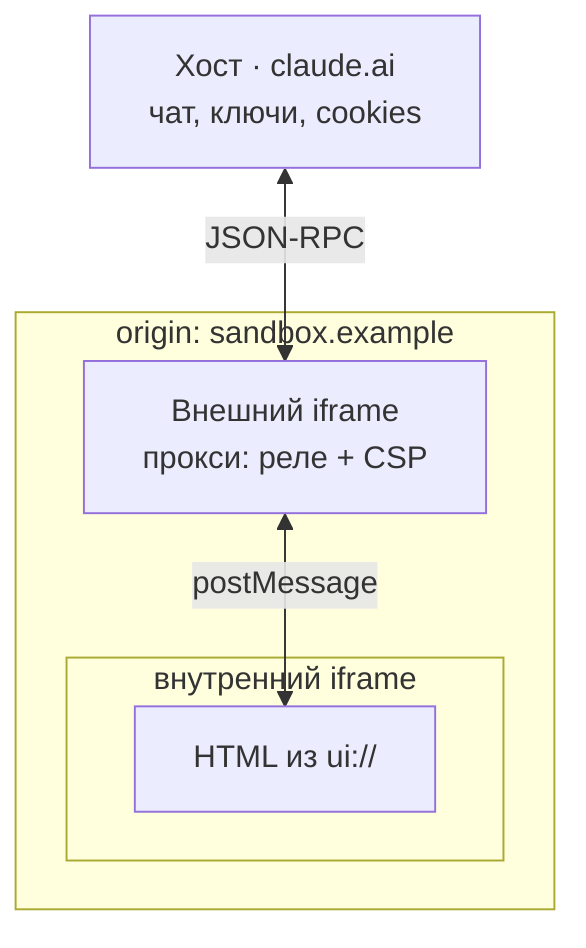

::header::

# Жизненный цикл

::default::

<div class="flow">

  <div class="node" :class="{ on: $clicks >= 1 && $clicks <= 2 }">
    <div class="t">MCP-сервер</div>
    <div class="s">тулы + <code>ui://</code></div>
  </div>

  <div class="edge" :class="{ on: $clicks >= 1 && $clicks <= 2 }">
    <div class="wire"></div>
    <div class="cap">
      <div class="proto">MCP</div>
      <div class="pay">
        <span :class="{ vis: $clicks === 1 }">HTML-шаблон</span>
        <span :class="{ vis: $clicks >= 2 }">вызов тула → результат</span>
      </div>
    </div>
  </div>

  <div class="node" :class="{ on: $clicks >= 1 }">
    <div class="t">Host</div>
    <div class="s">чат-клиент</div>
  </div>

  <div class="edge" :class="{ on: $clicks >= 3 }">
    <div class="wire"></div>
    <div class="cap">
      <div class="proto">postMessage</div>
      <div class="pay">
        <span :class="{ vis: $clicks >= 3 }">тема, размеры, аргументы</span>
      </div>
    </div>
  </div>

  <div class="node" :class="{ on: $clicks >= 3 }">
    <div class="t">View</div>
    <div class="s">iframe</div>
  </div>

</div>

::right::

<div class="phases">
  <div class="ph" v-click="1" :class="{ cur: $clicks === 1 }"><span class="n">1</span><div><b>Подключение</b><br>хост забирает HTML-шаблон</div></div>
  <div class="ph" v-click="2" :class="{ cur: $clicks === 2 }"><span class="n">2</span><div><b>Вызов</b><br>модель зовёт тул, сервер отдаёт результат</div></div>
  <div class="ph" v-click="3" :class="{ cur: $clicks === 3 }"><span class="n">3</span><div><b>Рендер</b><br>iframe, тема, размеры, аргументы, результат</div></div>
  <div class="ph" v-click="4" :class="{ cur: $clicks === 4 }"><span class="n">4</span><div><b>Интерактив</b><br>виджет зовёт тулы обратно через хост</div></div>
</div>

<style scoped>
.flow { display: flex; flex-direction: column; align-items: center; gap: 0; transform: translateY(-20px); }

.node {
  width: 100%; max-width: 20rem; padding: 1rem 1.4rem; text-align: center;
  border: 2px solid rgba(255,255,255,0.16); border-radius: 14px;
  background: rgba(255,255,255,0.04);
  opacity: 0.45; transition: all 0.35s ease;
}
.node.on {
  opacity: 1; border-color: var(--color-cyan);
  background: rgba(98,236,255,0.08);
  box-shadow: 0 0 2rem rgba(98,236,255,0.18);
}
.node .t { font-size: 1.5rem; font-weight: 800; }
.node.on .t { color: var(--color-cyan); }
.node .s { margin-top: 0.2rem; font-size: 1.05rem; color: var(--white-sub); }
.node .s code { background: transparent; font-size: 1.05rem; }

/* подпись выведена из потока, иначе линия смещается от центра узлов */
.edge { position: relative; display: flex; justify-content: center; width: 100%; max-width: 20rem; opacity: 0.35; transition: opacity 0.35s ease; }
.edge.on { opacity: 1; }

/* стрелка двусторонняя: линия + два треугольника через border-trick */
.wire { position: relative; width: 2px; height: 3.4rem; background: rgba(255,255,255,0.3); }
.edge.on .wire { background: var(--color-cyan); }
.wire::before, .wire::after {
  content: ''; position: absolute; left: 50%; transform: translateX(-50%);
  border-left: 5px solid transparent; border-right: 5px solid transparent;
}
.wire::before { top: 0; border-bottom: 7px solid rgba(255,255,255,0.3); }
.wire::after { bottom: 0; border-top: 7px solid rgba(255,255,255,0.3); }
.edge.on .wire::before { border-bottom-color: var(--color-cyan); }
.edge.on .wire::after { border-top-color: var(--color-cyan); }

.cap { position: absolute; top: 50%; left: calc(50% + 1rem); transform: translateY(-50%); }
.cap .proto { font-size: 1.1rem; font-weight: 700; letter-spacing: 0.02em; }
.edge.on .cap .proto { color: var(--color-cyan); }
/* оба payload-лейбла лежат в одной ячейке: переключение подписи не двигает схему */
.pay { position: relative; height: 1.4rem; }
.pay span {
  position: absolute; left: 0; top: 0; white-space: nowrap;
  font-size: 1rem; color: var(--white-sub);
  opacity: 0; transition: opacity 0.3s ease;
}
.pay span.vis { opacity: 1; }

.phases { display: flex; flex-direction: column; gap: 0.9rem; }
.ph {
  display: flex; align-items: flex-start; gap: 1rem;
  font-size: 1.3rem; line-height: 1.35;
  padding: 0.5rem 0.7rem; border-radius: 10px;
  border-left: 3px solid transparent;
  transition: all 0.35s ease;
}
.ph.cur { border-left-color: var(--color-cyan); background: rgba(98,236,255,0.07); }
.ph .n {
  flex: none; width: 2.2rem; height: 2.2rem; border-radius: 50%;
  display: grid; place-items: center; font-weight: 800; font-size: 1.2rem;
  background: var(--dark-blue); color: #fff;
  transition: all 0.35s ease;
}
.ph.cur .n { background: var(--color-cyan); color: var(--black); }
.ph b { font-size: 1.4rem; }
</style>

<!--
У нас есть по сути три участника. Сервер объявляет тулы и UI-ресурсы. Хост — это чат-клиент: он держит айфрейм песочницу и проксирует всё между сервером и виджетом. 

Жизненный цикл в четыре фазы.

[click] При подключении хост забирает у сервера HTML-шаблон. До любого вызова тула, заранее. И кеширует его

[click] Пользователь спрашивает, модель зовёт тул, сервер возвращает результат.

[click] Хост поднимает iframe, отдаёт ему тему и размеры контейнера, потом аргументы тула и его результат. Виджет вычисляется, строится и отрисовывается пользователю

[click] Пользователь работает с виджетом. Виджет может позвать тул обратно, через хост. Перед тем как убрать виджет с экрана, хост его предупреждает: можно сохранить состояние.
-->


---

# content и structuredContent

<div class="branch">
  <div class="root" v-click="1">результат тула</div>
  <div class="arms">
    <div class="arm" v-click="2">
      <div class="pipe cyan"><code>content</code></div>
      <div class="dst">→ контекст модели</div>
    </div>
    <div class="arm" v-click="3">
      <div class="pipe accent"><code>structuredContent</code></div>
      <div class="dst">→ виджет</div>
    </div>
  </div>
  <div class="payoff" v-click="4">Контекст не раздувается. Пользователь видит таблицу.</div>
</div>

<style scoped>
.branch { margin-top: 1.4rem; }
.root { font-size: 1.6rem; font-weight: 700; text-align: center; padding: 0.8rem; border: 1px solid rgba(255,255,255,0.2); border-radius: 10px; max-width: 24rem; margin: 0 auto; }
.arms { margin-top: 1.6rem; display: grid; grid-template-columns: 1fr 1fr; gap: 2rem; }
.arm { padding: 1.4rem 1.6rem; border-radius: 12px; background: rgba(255,255,255,0.04); border: 1px solid rgba(255,255,255,0.12); }
.pipe code { font-size: 1.8rem !important; font-weight: 800; background: transparent; }
.pipe.cyan code { color: var(--color-cyan); }
.pipe.accent code { color: var(--color-green); }
.dst { margin-top: 0.7rem; font-size: 1.5rem; font-weight: 600; }
.det { margin-top: 0.6rem; font-size: 1.3rem; color: var(--white-sub); }
.payoff { margin-top: 1.8rem; font-size: 1.7rem; font-weight: 600; text-align: center; }
</style>

<!--
[click] Результат вызова в таком случае поедет к нам концептуально двумя потоками. У нас есть поля контент и стракчед контент, которые уже давно в спеке MCP, но в MCP Apps они немного иначе себя ведут.

[click] content — текст, который попадает в контекст модели. 

[click] structuredContent — данные, которые попадают в виджет. Двадцать моделей наушников с характеристиками, вариантами, остатками по складам и сроками доставки.

[click] В магазине это позволяет Пользователю показать короткое саммари и таблицу товаров, пользователь смотрит и сравнивает. Модель получает три строки текста и не платит контекстом за то, чего ей знать не нужно. В оригинале MCP требует, чтобы тул, возвращающий structuredContent, должен (SHOULD) продублировать те же данные сериализованным JSON в TextContent-блоке content, а при наличии обоих полей они должны быть семантически эквивалентны — одна информация в двух формах. Это осознанный асимметричный паттерн MCP Apps, и он расходится с требованием эквивалентности. Работает он ровно потому, что настоящий потребитель полных данных — виджет, а не модель. Формально это отступление от гайдлайнов обратной совмести, и вокруг этого нюанса до сих пор идёт спор 
-->

---

# Что под капотом

<div class="chan" v-click="1">виджет &nbsp;→&nbsp; хост &nbsp;→&nbsp; сервер <span class="s">· JSON-RPC 2.0 поверх postMessage</span></div>

<div class="note" v-click="2">каждый вызов логируется · хост может требовать подтверждения</div>

<div class="vis" v-click="3"><code>"visibility": ["model", "app"]</code><span>по умолчанию</span></div>
<div class="vis hi" v-click="4"><code>"visibility": ["app"]</code><span>модель тул не видит вообще</span></div>

<style scoped>
.chan { margin-top: 1.2rem; font-size: 1.8rem; font-weight: 700; }
.chan .s { font-size: 1.2rem; font-weight: 400; color: var(--white-sub); }
.note { margin-top: 1rem; font-size: 1.35rem; color: var(--white-sub); }
.vis { margin-top: 1.1rem; display: flex; align-items: baseline; gap: 1.2rem; }
.vis code { font-size: 1.6rem !important; background: rgba(255,255,255,0.05); padding: 0.3rem 0.8rem; border-radius: 6px; }
.vis span { font-size: 1.3rem; color: var(--white-sub); }
.vis.hi code { color: var(--color-green); border: 1px solid var(--color-green); }
.ex { margin-top: 1.4rem; }
</style>

<!--
[click] Виджет говорит с хостом через JSON-RPC поверх postMessage. Свой формат сообщений авторы не изобретали, это всё JSON-RPC. Хост — это вахтёр. Виджет (картинка в чате) хочет что-то у сервера, но сам внутрь не заходит: подходит к вахтёру и просит. 

[click] Вахтёр записывает просьбу в журнал и, если дело серьёзное, переспрашивает пользователя «точно?». 

[click] Каждый вызов из виджета логируется, проходит через хост, и хост может потребовать подтверждения у пользователя. У тула есть поле visibility. [click] А visibility — это список, кому вообще можно подходить к конкретной кнопке: обычно и ИИ, и человеку; но можно оставить кнопку только человеку, и тогда ИИ про неё даже не знает.

-->

---

# Код

```json {1-5|7-11|10|all}{lines:true}
{
  "uri": "ui://shop/compare",
  "name": "Сравнение наушников",
  "mimeType": "text/html;profile=mcp-app"
}

{
  "name": "compare_products",
  "inputSchema": { "properties": { "product_ids": {} } },
  "_meta": { "ui": { "resourceUri": "ui://shop/compare" } }
}
```

<div class="foot">Внутри iframe — обычный HTML. Тему и размеры хост отдаёт сам.</div>

<style scoped>
:deep(.slidev-code) { font-size: 1.1rem; margin-top: 0.6rem; }
.foot { margin-top: 1.4rem; font-size: 1.4rem; color: var(--white-sub); }
</style>

<!--
Весь диф сервера. Объявляем ресурс: URI со схемой ui://, имя, MIME-тип.

[click] Тул ссылается на ресурс.

[click] Через _meta, вот эта строка.

[click] Всё вместе. Внутри iframe обычный HTML. Тему и размеры контейнера хост отдаст сам при инициализации.

-->

---
layout: interjection
variant: 5
transition: fade
---

<TextBig>Демо ui://</TextBig>


<style scoped>
.cue { margin-top: 1.6rem; font-size: 1.5rem; color: var(--white-sub); }
</style>

<!--
давайте посмотрим, как выглядят виджеты, отправляемые через UI.

Модель не тратит ни токена


-->

---

# Границы безопасности

<div class="rules">
  <div class="rule" v-click>sandboxed iframe: ни DOM хоста, ни cookies, ни storage</div>
  <div class="rule" v-click>сети нет по умолчанию · домены в CSP, хост их применяет</div>
  <div class="rule" v-click>связь только через postMessage · аудируемые JSON-RPC</div>
  <div class="rule" v-click>хост может требовать подтверждения на любой вызов</div>
  <div class="rule" v-click>хосты без расширения показывают обычный текст</div>
</div>


<style scoped>
.rules { margin-top: 1.4rem; display: flex; flex-direction: column; gap: 0.8rem; }
.rule { font-size: 1.55rem; font-weight: 500; padding: 0.7rem 1.2rem; border-left: 4px solid var(--dark-blue); background: rgba(255,255,255,0.03); }
.hook { margin-top: 1.6rem; font-size: 1.6rem; font-weight: 700; color: var(--color-green); }
</style>

<!--
Чтобы эта вся прелесть красиво рендерилась, мы вынуждены иметь множество ограничений

[click] Виджет живёт в sandboxed iframe: не можем достучаться до DOM хоста, ни до его cookies, ни до storageй.

[click] Сети у виджета нет по умолчанию. Сервер декларирует домены в CSP-метаданных, хост их применяет. Ничего не задекларировал — исходящих соединений не будет.

[click] Связь только через window postMessage, аудируемыми сообщениями - мы можем запрещать, разрешать, отправлять в сервисы аналитики и так далее.

[click] Хост может требовать подтверждения на любой вызов тула из виджета. Диалог, который выскочил на «в корзину», — это оно.

[click] Хосты без расширения покажут обычный текст. Текстовый фолбэк пишется в сервере с первого дня.

[click] Пункт первый я и разберу: sandboxed iframe, которых оказалось два.
-->

---

# Почему iframe в iframe

<div class="cond" v-click="1">HTML приезжает <b>строкой</b></div>

<table class="fork">
  <tbody>
    <tr v-click="2"><td class="fl">без allow-scripts</td><td>виджет мёртв: ни JS, ни интерактива</td></tr>
    <tr v-click="3" class="bad"><td class="fl">scripts + same-origin</td><td>песочницы нет: cookies, storage; скрипт снимает sandbox с себя</td></tr>
    <tr v-click="4"><td class="fl">scripts без same-origin</td><td>opaque origin: ни storage, ни cookies, ни однооригинных запросов</td></tr>
  </tbody>
</table>


<style scoped>
.cond { margin-top: 1.2rem; font-size: 1.5rem; line-height: 1.4; }
.cond code { color: var(--color-cyan); }
.fork { margin-top: 1.6rem; border-collapse: collapse; font-size: 1.4rem; width: 100%; }
.fork td { padding: 0.9rem 1.2rem; border: 1px solid rgba(255,255,255,0.1); vertical-align: top; }
.fork .fl { font-weight: 700; color: var(--color-cyan); white-space: nowrap; }
.fork tr.bad td { color: #ff9a9a; }
.fork tr.bad .fl { color: #ff5a5a; }
.out { margin-top: 1.6rem; font-size: 1.7rem; font-weight: 700; color: var(--color-green); }
</style>

<!--
Главная мысль одной фразой: sandbox — это наручники на виджете, а флаги allow-* снимают их по одному. Есть одна комбинация, которая снимает наручники полностью и пускает виджета в дом хоста — вот её и нельзя ставить. Остальное на слайде объясняет, почему.
Сначала про origin (источник: протокол + домен + порт, браузерное «удостоверение личности» страницы), потому что без него ничего не понять. Браузер пускает один код к данным другого, только если у них одинаковый origin. Одинаковый — «свои», можно читать cookies и storage друг друга, лезть в чужой DOM (структуру страницы). Разный — «чужие», доступ закрыт. Это правило и называется same-origin policy. Мы выстраиваем защиту нашего виджета через атрибуты у айфрейма

 три способа выставить sandbox:
Без allow-scripts. JS не запускается совсем. Виджет покажет статичную картинку из HTML и CSS, но ничего не посчитает и на клики не среагирует. Для интерактивного виджета это «мёртв»: безопасно, но бесполезно, если нужна логика.
allow-scripts + allow-same-origin — ловушка. allow-same-origin велит браузеру оставить виджету его настоящий origin. А origin у него, как мы выяснили, хостовский. Значит, скрипт виджета становится «своим» хосту: читает его cookies и localStorage, лезет в его DOM. Хуже: он дотягивается до собственного тега <iframe> и снимает с себя атрибут sandbox (frameElement.removeAttribute('sandbox')), перезагружается — и остаётся вообще без ограничений. Песочницы после этого нет. Эту пару на «своём» контенте (а срcdoc/blob именно такой) ставить нельзя — про это прямо предупреждает MDN.
allow-scripts без allow-same-origin — рабочий безопасный режим. JS работает, виджет живой. Но allow-same-origin не выдан, поэтому браузер даёт виджету opaque origin (пустой уникальный «никакой» источник, который не совпадает ни с кем). Из-за этого: localStorage и cookies недоступны — обращение к storage просто кидает ошибку; а любой запрос к настоящему бэкенду считается кросс-оригинным и упирается в CORS (cross-origin resource sharing — браузерная проверка, разрешил ли чужой сервер такой запрос). Виджет заперт наедине с собой. Ровно то, что нужно для чужого кода.

-->

---
layout: two-cols
variant: 11
leftWidth: 52%
align: center
---

::header::

# Внешний фрейм — прокси

::default::

<div v-click="1">



</div>

::right::

<div class="gives">
  <div class="g" v-click="2">граница origin</div>
  <div class="g" v-click="3">применение CSP по метаданным ресурса</div>
  <div class="g" v-click="4">нормализация JSON-RPC до хоста</div>
  <div class="note" v-click="5">Гость хоста не видит. Он видит прокси.</div>
</div>

<style scoped>
.gives { display: flex; flex-direction: column; gap: 1.1rem; }
.g { font-size: 1.5rem; font-weight: 600; padding-left: 1.2rem; border-left: 4px solid var(--dark-blue); }
.gives .note { margin-top: 1rem; font-size: 1.6rem; font-weight: 700; color: var(--color-green); border: none; padding: 0; }
:deep(.slidev-code) { font-size: 0.8rem; }
</style>

<!--
 между виджетом и хостом ставят второй iframe-прослойку на чужом origin, чтобы виджет вообще не касался дома хоста напрямую. Метафора с прошлых слайдов дотягивается сюда: у вахтёра появляется ещё и турникет в предбаннике — гость доходит только до турникета, а не до самой стойки.
Как читать картинку снизу вверх. Внизу — внутренний iframe с HTML виджета (из ui://). Он говорит не сразу хосту, а среднему блоку — внешнему iframe — по postMessage. Этот внешний iframe и есть прокси: он сидит на отдельном origin (sandbox.example, не claude.ai), проверяет сообщение, навешивает CSP и только потом передаёт наверх хосту по JSON-RPC. Хост с ключами и cookies — сверху, и до него достаёт лишь прокси, а не сам виджет.
Три буллета справа — что даёт эта прослойка:
граница origin — прокси живёт на чужом origin, поэтому виджет физически не «свой» хосту. Даже если внутренний фрейм сорвётся с цепи, он упрётся в прокси, а не в дом с cookies.
применение CSP по метаданным ресурса — прокси включает те самые списки разрешённых доменов (connectDomains и прочие), которые сервер объявил в метаданных ui://-ресурса. Сеть виджета режется здесь.
нормализация JSON-RPC до хоста — прокси приводит сырые postMessage от виджета к чистому, проверенному JSON-RPC и лишь его пропускает хосту. Мусор и самодельные сообщения наверх не проходят.
-->
