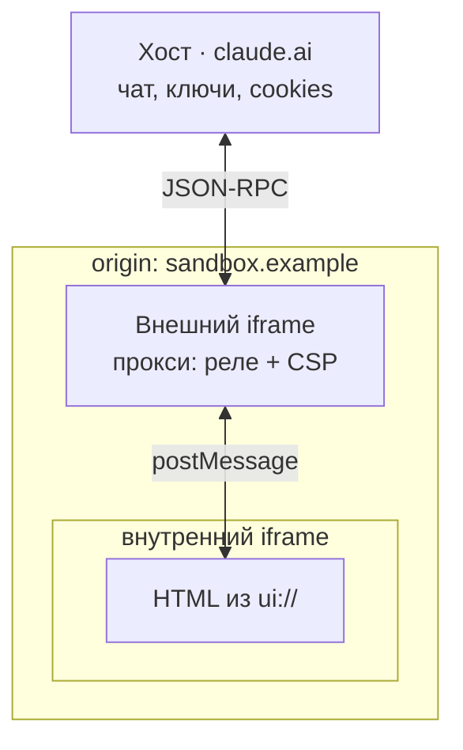

# Добро пожаловать<br>в новый веб с MCP Apps

Троицкий Роман @ ПАО Сбербанк

<!--
Всем привет! чёт парни жути нагнали, да?)
--> 

---
layout: two-cols
variant: 4
leftWidth: 50%
transition: slide-left
rightAlign: center
---

## WHOAMI

<v-clicks>
  <ul>
    <li>Диджитал-спецназ;</li>
    <li>Влюблён во фронтенд;</li>
    <li>Вхожу в ПК Сбера, HolyJS, MoscowCSS;</li>
    <li>ИТМО магистратура;</li>
    <li>I use Arch btw</li>
  </ul>
</v-clicks>

::right::
<WhoAmI :images="['/images/whoami/1.jpg', '/images/whoami/2.jpg', '/images/whoami/3.jpg']" alt="Рома Троицкий на митапах и конфах без регистрации и смс" />

<!--
Я больше не фронтендер, с мая одобрен, с июля перешёл полностью в дата саянс,
получается, с джаваскрипта на пайтон, в общем, программировать так и не научился.
Задачи у меня создавать и интегрировать агентов во все возможные системы, и любой ценой заставлять их работать так, как ожидает заказчик, так что если вам взгрустнулось и думаете, что работы не будет - да всё будет, просто поменяется. А можете поднять руку те, кто любит не просто прогать, а прогать Интерфейсы? я тоже из тех, кто прогает интерфейсы по любви, так что мы ещё не раз увидимся по ту или иную сторону микрофона на тех или иных событиях
-->

---
layout: interjection
variant: 4
transition: fade
---

<TextBig>Демо</TextBig>

<!--
а пока мне бы хотелось поговорить о таких забавных вещах, которые происходят в вебе. 
Примерно 30 лет развития технологий и дизайна люди старательно делали интерфейсы более доступными, красивыми, понятными, от терминальных матричных тёмно зелёных буковок мы пришли к крупным понятным кнопкам, инпутам, дропдаунам, дейтпикерам, и вот два ка два шестой год - вбиваем текстом ну или в лучшем случае голосом в чат с моделькой запрос 
"подбери мне наушники такой-то цены, чтоб доставка туда то, магазин такой-то" и смотрим на текст. Да, есть конечно голосовой мод и так далее, но чёт на любителя эта вся история, как мне кажется. Чуть лучше показывает перплексити, прикрепляя картинки, но в целом это не те карточки товаров. Да и вообще видите, модель попыталась посмотреть страницу, а Мегамаркет ей не отдал - там только то, что удалось по метаинформации или ещё как-то выцепить, дай боже не додумано непонятно из чего. 
Сегодня я расскажу, как мы решаем эту проблему в Сбере.
-->

---

# Контракт тула

<div class="grid2">

<div class="tools">
<pre>search_products
get_product
list_variants
…</pre>
<div class="sub">20+ Tools</div>
</div>

```json {all|3|4-10|11}{lines:true}
{
  "name": "search_products",
  "description": "Поиск по каталогу: категория, цена, рейтинг.",
  "inputSchema": {
    "properties": {
      "query":    { "type": "string" },
      "category": { "enum": ["headphones"] }
    },
    "required": ["query"]
  },
  "annotations": { "readOnlyHint": true }
}
```

</div>

<style scoped>
.grid2 { display: grid; grid-template-columns: 0.9fr 1.6fr; gap: 2rem; align-items: start; margin-top: 1.4rem; }
.tools pre { font-size: 1.5rem; line-height: 1.6; color: var(--color-cyan); }
.tools .sub { margin-top: 0.8rem; font-size: 1.2rem; }
.grid2 :deep(.slidev-code) { font-size: 1.05rem; }
</style>

<!--
Естественно, чтобы модель могла видеть и вызывать поиск, детальную информацию, чекаут и корзину, мы можем подключиться к MCP. У меня получилось разложить на примерно 20 тулов, каждый из которых оформлен по всем канонам: подробный дескрипшн, в оригинале на английском языке, описан стандарт общения, аннотация, которая подскажет модели о том, что инструмент только читает, не меняет состояний. Я уже подключил эти тулы к Cloud Desktop - давайте посмотрим
-->

---

# С MCP

<style scoped>
.log { margin-top: 1.6rem; display: flex; flex-direction: column; gap: 0.8rem; }
.line { font-size: 1.5rem; padding: 0.7rem 1.1rem; background: rgba(255,255,255,0.04); border-left: 3px solid rgba(255,255,255,0.2); }
.line .who { display: inline-block; min-width: 5.5rem; color: var(--white-sub); }
.line .call { color: var(--color-cyan); font-weight: 700; }
.line.bad { border-left-color: #ff5a5a; color: #ff9a9a; }
.line.bad b { color: #ff5a5a; }
.verdict { margin-top: 1.8rem; font-size: 2rem; font-weight: 800; }
</style>

<!--
Выполняем Запрос: наушники для созвонов, до 5 тысяч, к пятнице.
Агент зовёт search_products, берёт первую модель по рейтингу и обещает доставку к пятнице.
вызвался тул, отработал корректно, сейчас показывать не буду, но на большинстве этих товаров будет доставка не завтра, и хоть внешне всё супер, по факту мы получим недостаточный результат. Хочется дать чего-то лучше, да? 
Давайте разбираться
-->

---
layout: two-cols
variant: 11
leftWidth: 42%
align: top
---

::header::

# Почему так

::default::

<div class="okcard" v-click="1">
  <div class="uri">estimate_delivery</div>
</div>

::right::

<div class="qs">
  <div class="q" v-click="2">В каком порядке вызвать инструменты?</div>
  <div class="q" v-click="3">Рейтинг — это критерий выбора?</div>
  <div class="verdict" v-click="4">Схема отвечает на вопрос «что делает этот тул».</div>
</div>

<style scoped>
.okcard { margin-top: 1rem; padding: 1.4rem 1.6rem; border: 2px solid var(--color-green); border-radius: 12px; background: rgba(86,255,113,0.06); }
.okcard .uri { font-size: 1.9rem; font-weight: 700; color: var(--color-cyan); }
.okcard .ok { margin-top: 0.6rem; font-size: 1.3rem; color: var(--color-green); }
.qs { display: flex; flex-direction: column; gap: 1.1rem; }
.q { font-size: 1.7rem; font-weight: 600; padding-left: 1.2rem; border-left: 4px solid var(--dark-blue); }
.qs .verdict { margin-top: 0.8rem; font-size: 1.5rem; color: var(--white-sub); font-weight: 400; }
</style>

<!--
Сами тулы и сервер написаны правильно, я её показывал минуту назад. Агент просто не знает, что инструменты можно чейнить, объединять в цепочку.

[click] агент видит из описаний, что есть поиск, есть адрес, есть инфо о товаре, всё по отдельности

[click] но без явных шаманств с промптингом или кастомным скиллом 

[click] мы чаще всего получим просто выдачу одного из вызванных инструментов. 
[click] Причём всё равно в текстовом формате - пользователь видит тупо текст и ссылку на внешний сервис. Можно ли лучше? Конечно! 

-->

---

# Два ресурса

<div class="split">
  <div class="half" v-click="1">
    <div class="uri cyan"><code>ui://</code></div>
    <div class="fix">интерфейс для человека</div>
  </div>
  <div class="half" v-click="2">
    <div class="uri accent"><code>skill://</code></div>
    <div class="fix">инструкция для агента</div>
  </div>
</div>

<div class="foot" v-click="3">И то и другое — <b>resources</b> в MCP</div>

<style scoped>
.split { margin-top: 2.4rem; display: grid; grid-template-columns: 1fr 1fr; gap: 2rem; }
.half { padding: 2rem 1.8rem; border: 1px solid rgba(255,255,255,0.16); border-radius: 14px; background: rgba(255,255,255,0.04); }
.uri code { font-size: 2.6rem !important; font-weight: 800; background: transparent; }
.uri.cyan code { color: var(--color-cyan); }
.uri.accent code { color: var(--color-green); }
.fix { margin-top: 1.1rem; font-size: 1.7rem; font-weight: 700; }
.foot { margin-top: 2.2rem; font-size: 1.8rem; }
</style>

<!--
У нас в 2026 году появилось две возможности сделать эту выдачу красивее, удобнее и точнее

[click] Для людей мы теперь можем отрисовать живой виджет в айфреймах, где человек может посмотреть на товар, галерею фото покрутить, посмотреть табличку характеристик и вернуться обратно в выдачу, отфильтровать её, вернуться обратно

[click] А проблему чейнинга, организации вызовов инструментов в цепочки, мы можем решить, отдавая кастомный скилл через ресурс — skill://.

[click] Рабочая группа Skills Over MCP формулирует это так: скиллы — это про управление контекстом, а MCP — протокол контекста. Агент уже ходит на сервер за тулами. За инструкцией он может ходить туда же.

-->

---
layout: two-cols
variant: 11
leftWidth: 52%
align: center
---

::header::

# Жизненный цикл

::default::

<div class="flow">

  <div class="node" :class="{ on: $clicks >= 1 && $clicks <= 2 }">
    <div class="t">MCP-сервер</div>
    <div class="s">тулы + <code>ui://</code></div>
  </div>

  <div class="edge" :class="{ on: $clicks >= 1 && $clicks <= 2 }">
    <div class="wire"></div>
    <div class="cap">
      <div class="proto">MCP</div>
      <div class="pay">
        <span :class="{ vis: $clicks === 1 }">HTML-шаблон</span>
        <span :class="{ vis: $clicks >= 2 }">вызов тула → результат</span>
      </div>
    </div>
  </div>

  <div class="node" :class="{ on: $clicks >= 1 }">
    <div class="t">Host</div>
    <div class="s">чат-клиент</div>
  </div>

  <div class="edge" :class="{ on: $clicks >= 3 }">
    <div class="wire"></div>
    <div class="cap">
      <div class="proto">postMessage</div>
      <div class="pay">
        <span :class="{ vis: $clicks >= 3 }">тема, размеры, аргументы</span>
      </div>
    </div>
  </div>

  <div class="node" :class="{ on: $clicks >= 3 }">
    <div class="t">View</div>
    <div class="s">iframe</div>
  </div>

</div>

::right::

<div class="phases">
  <div class="ph" v-click="1" :class="{ cur: $clicks === 1 }"><span class="n">1</span><div><b>Подключение</b><br>хост забирает HTML-шаблон</div></div>
  <div class="ph" v-click="2" :class="{ cur: $clicks === 2 }"><span class="n">2</span><div><b>Вызов</b><br>модель зовёт тул, сервер отдаёт результат</div></div>
  <div class="ph" v-click="3" :class="{ cur: $clicks === 3 }"><span class="n">3</span><div><b>Рендер</b><br>iframe, тема, размеры, аргументы, результат</div></div>
  <div class="ph" v-click="4" :class="{ cur: $clicks === 4 }"><span class="n">4</span><div><b>Интерактив</b><br>виджет зовёт тулы обратно через хост</div></div>
</div>

<style scoped>
.flow { display: flex; flex-direction: column; align-items: center; gap: 0; transform: translateY(-20px); }

.node {
  width: 100%; max-width: 20rem; padding: 1rem 1.4rem; text-align: center;
  border: 2px solid rgba(255,255,255,0.16); border-radius: 14px;
  background: rgba(255,255,255,0.04);
  opacity: 0.45; transition: all 0.35s ease;
}
.node.on {
  opacity: 1; border-color: var(--color-cyan);
  background: rgba(98,236,255,0.08);
  box-shadow: 0 0 2rem rgba(98,236,255,0.18);
}
.node .t { font-size: 1.5rem; font-weight: 800; }
.node.on .t { color: var(--color-cyan); }
.node .s { margin-top: 0.2rem; font-size: 1.05rem; color: var(--white-sub); }
.node .s code { background: transparent; font-size: 1.05rem; }

/* подпись выведена из потока, иначе линия смещается от центра узлов */
.edge { position: relative; display: flex; justify-content: center; width: 100%; max-width: 20rem; opacity: 0.35; transition: opacity 0.35s ease; }
.edge.on { opacity: 1; }

/* стрелка двусторонняя: линия + два треугольника через border-trick */
.wire { position: relative; width: 2px; height: 3.4rem; background: rgba(255,255,255,0.3); }
.edge.on .wire { background: var(--color-cyan); }
.wire::before, .wire::after {
  content: ''; position: absolute; left: 50%; transform: translateX(-50%);
  border-left: 5px solid transparent; border-right: 5px solid transparent;
}
.wire::before { top: 0; border-bottom: 7px solid rgba(255,255,255,0.3); }
.wire::after { bottom: 0; border-top: 7px solid rgba(255,255,255,0.3); }
.edge.on .wire::before { border-bottom-color: var(--color-cyan); }
.edge.on .wire::after { border-top-color: var(--color-cyan); }

.cap { position: absolute; top: 50%; left: calc(50% + 1rem); transform: translateY(-50%); }
.cap .proto { font-size: 1.1rem; font-weight: 700; letter-spacing: 0.02em; }
.edge.on .cap .proto { color: var(--color-cyan); }
/* оба payload-лейбла лежат в одной ячейке: переключение подписи не двигает схему */
.pay { position: relative; height: 1.4rem; }
.pay span {
  position: absolute; left: 0; top: 0; white-space: nowrap;
  font-size: 1rem; color: var(--white-sub);
  opacity: 0; transition: opacity 0.3s ease;
}
.pay span.vis { opacity: 1; }

.phases { display: flex; flex-direction: column; gap: 0.9rem; }
.ph {
  display: flex; align-items: flex-start; gap: 1rem;
  font-size: 1.3rem; line-height: 1.35;
  padding: 0.5rem 0.7rem; border-radius: 10px;
  border-left: 3px solid transparent;
  transition: all 0.35s ease;
}
.ph.cur { border-left-color: var(--color-cyan); background: rgba(98,236,255,0.07); }
.ph .n {
  flex: none; width: 2.2rem; height: 2.2rem; border-radius: 50%;
  display: grid; place-items: center; font-weight: 800; font-size: 1.2rem;
  background: var(--dark-blue); color: #fff;
  transition: all 0.35s ease;
}
.ph.cur .n { background: var(--color-cyan); color: var(--black); }
.ph b { font-size: 1.4rem; }
</style>

<!--
У нас есть по сути три участника. Сервер объявляет тулы и UI-ресурсы. Хост — это чат-клиент: он держит айфрейм песочницу и проксирует всё между сервером и виджетом. 

Жизненный цикл в четыре фазы.

[click] При подключении хост забирает у сервера HTML-шаблон. До любого вызова тула, заранее. И кеширует его

[click] Пользователь спрашивает, модель зовёт тул, сервер возвращает результат.

[click] Хост поднимает iframe, отдаёт ему тему и размеры контейнера, потом аргументы тула и его результат. Виджет вычисляется, строится и отрисовывается пользователю

[click] Пользователь работает с виджетом. Виджет может позвать тул обратно, через хост. Перед тем как убрать виджет с экрана, хост его предупреждает: можно сохранить состояние.
-->


---

# content и structuredContent

<div class="branch">
  <div class="root" v-click="1">результат тула</div>
  <div class="arms">
    <div class="arm" v-click="2">
      <div class="pipe cyan"><code>content</code></div>
      <div class="dst">→ контекст модели</div>
    </div>
    <div class="arm" v-click="3">
      <div class="pipe accent"><code>structuredContent</code></div>
      <div class="dst">→ виджет</div>
    </div>
  </div>
  <div class="payoff" v-click="4">Контекст не раздувается. Пользователь видит таблицу.</div>
</div>

<style scoped>
.branch { margin-top: 1.4rem; }
.root { font-size: 1.6rem; font-weight: 700; text-align: center; padding: 0.8rem; border: 1px solid rgba(255,255,255,0.2); border-radius: 10px; max-width: 24rem; margin: 0 auto; }
.arms { margin-top: 1.6rem; display: grid; grid-template-columns: 1fr 1fr; gap: 2rem; }
.arm { padding: 1.4rem 1.6rem; border-radius: 12px; background: rgba(255,255,255,0.04); border: 1px solid rgba(255,255,255,0.12); }
.pipe code { font-size: 1.8rem !important; font-weight: 800; background: transparent; }
.pipe.cyan code { color: var(--color-cyan); }
.pipe.accent code { color: var(--color-green); }
.dst { margin-top: 0.7rem; font-size: 1.5rem; font-weight: 600; }
.det { margin-top: 0.6rem; font-size: 1.3rem; color: var(--white-sub); }
.payoff { margin-top: 1.8rem; font-size: 1.7rem; font-weight: 600; text-align: center; }
</style>

<!--
[click] Результат вызова в таком случае поедет к нам концептуально двумя потоками. У нас есть поля контент и стракчед контент, которые уже давно в спеке MCP, но в MCP Apps они немного иначе себя ведут.

[click] content — текст, который попадает в контекст модели. 

[click] structuredContent — данные, которые попадают в виджет. Двадцать моделей наушников с характеристиками, вариантами, остатками по складам и сроками доставки.

[click] В магазине это позволяет Пользователю показать короткое саммари и таблицу товаров, пользователь смотрит и сравнивает. Модель получает три строки текста и не платит контекстом за то, чего ей знать не нужно. В оригинале MCP требует, чтобы тул, возвращающий structuredContent, должен (SHOULD) продублировать те же данные сериализованным JSON в TextContent-блоке content, а при наличии обоих полей они должны быть семантически эквивалентны — одна информация в двух формах. Это осознанный асимметричный паттерн MCP Apps, и он расходится с требованием эквивалентности. Работает он ровно потому, что настоящий потребитель полных данных — виджет, а не модель. Формально это отступление от гайдлайнов обратной совмести, и вокруг этого нюанса до сих пор идёт спор 
-->

---

# Что под капотом

<div class="chan" v-click="1">виджет &nbsp;→&nbsp; хост &nbsp;→&nbsp; сервер <span class="s">· JSON-RPC 2.0 поверх postMessage</span></div>

<div class="note" v-click="2">каждый вызов логируется · хост может требовать подтверждения</div>

<div class="vis" v-click="3"><code>"visibility": ["model", "app"]</code><span>по умолчанию</span></div>
<div class="vis hi" v-click="4"><code>"visibility": ["app"]</code><span>модель тул не видит вообще</span></div>

<style scoped>
.chan { margin-top: 1.2rem; font-size: 1.8rem; font-weight: 700; }
.chan .s { font-size: 1.2rem; font-weight: 400; color: var(--white-sub); }
.note { margin-top: 1rem; font-size: 1.35rem; color: var(--white-sub); }
.vis { margin-top: 1.1rem; display: flex; align-items: baseline; gap: 1.2rem; }
.vis code { font-size: 1.6rem !important; background: rgba(255,255,255,0.05); padding: 0.3rem 0.8rem; border-radius: 6px; }
.vis span { font-size: 1.3rem; color: var(--white-sub); }
.vis.hi code { color: var(--color-green); border: 1px solid var(--color-green); }
.ex { margin-top: 1.4rem; }
</style>

<!--
[click] Виджет говорит с хостом через JSON-RPC поверх postMessage. Свой формат сообщений авторы не изобретали, это всё JSON-RPC. Хост — это вахтёр. Виджет (картинка в чате) хочет что-то у сервера, но сам внутрь не заходит: подходит к вахтёру и просит. 

[click] Вахтёр записывает просьбу в журнал и, если дело серьёзное, переспрашивает пользователя «точно?». 

[click] Каждый вызов из виджета логируется, проходит через хост, и хост может потребовать подтверждения у пользователя. У тула есть поле visibility. [click] А visibility — это список, кому вообще можно подходить к конкретной кнопке: обычно и ИИ, и человеку; но можно оставить кнопку только человеку, и тогда ИИ про неё даже не знает.

-->

---

# Код

```json {1-5|7-11|10|all}{lines:true}
{
  "uri": "ui://shop/compare",
  "name": "Сравнение наушников",
  "mimeType": "text/html;profile=mcp-app"
}

{
  "name": "compare_products",
  "inputSchema": { "properties": { "product_ids": {} } },
  "_meta": { "ui": { "resourceUri": "ui://shop/compare" } }
}
```

<div class="foot">Внутри iframe — обычный HTML. Тему и размеры хост отдаёт сам.</div>

<style scoped>
:deep(.slidev-code) { font-size: 1.1rem; margin-top: 0.6rem; }
.foot { margin-top: 1.4rem; font-size: 1.4rem; color: var(--white-sub); }
</style>

<!--
Весь диф сервера. Объявляем ресурс: URI со схемой ui://, имя, MIME-тип.

[click] Тул ссылается на ресурс.

[click] Через _meta, вот эта строка.

[click] Всё вместе. Внутри iframe обычный HTML. Тему и размеры контейнера хост отдаст сам при инициализации.

-->

---
layout: interjection
variant: 5
transition: fade
---

<TextBig>Демо ui://</TextBig>


<style scoped>
.cue { margin-top: 1.6rem; font-size: 1.5rem; color: var(--white-sub); }
</style>

<!--
давайте посмотрим, как выглядят виджеты, отправляемые через UI.

Модель не тратит ни токена


-->

---

# Границы безопасности

<div class="rules">
  <div class="rule" v-click>sandboxed iframe: ни DOM хоста, ни cookies, ни storage</div>
  <div class="rule" v-click>сети нет по умолчанию · домены в CSP, хост их применяет</div>
  <div class="rule" v-click>связь только через postMessage · аудируемые JSON-RPC</div>
  <div class="rule" v-click>хост может требовать подтверждения на любой вызов</div>
  <div class="rule" v-click>хосты без расширения показывают обычный текст</div>
</div>


<style scoped>
.rules { margin-top: 1.4rem; display: flex; flex-direction: column; gap: 0.8rem; }
.rule { font-size: 1.55rem; font-weight: 500; padding: 0.7rem 1.2rem; border-left: 4px solid var(--dark-blue); background: rgba(255,255,255,0.03); }
.hook { margin-top: 1.6rem; font-size: 1.6rem; font-weight: 700; color: var(--color-green); }
</style>

<!--
Чтобы эта вся прелесть красиво рендерилась, мы вынуждены иметь множество ограничений

[click] Виджет живёт в sandboxed iframe: не можем достучаться до DOM хоста, ни до его cookies, ни до storageй.

[click] Сети у виджета нет по умолчанию. Сервер декларирует домены в CSP-метаданных, хост их применяет. Ничего не задекларировал — исходящих соединений не будет.

[click] Связь только через window postMessage, аудируемыми сообщениями - мы можем запрещать, разрешать, отправлять в сервисы аналитики и так далее.

[click] Хост может требовать подтверждения на любой вызов тула из виджета. Диалог, который выскочил на «в корзину», — это оно.

[click] Хосты без расширения покажут обычный текст. Текстовый фолбэк пишется в сервере с первого дня.

[click] Пункт первый я и разберу: sandboxed iframe, которых оказалось два.
-->

---

# Почему iframe в iframe

<div class="cond" v-click="1">HTML приезжает <b>строкой</b></div>

<table class="fork">
  <tbody>
    <tr v-click="2"><td class="fl">без allow-scripts</td><td>виджет мёртв: ни JS, ни интерактива</td></tr>
    <tr v-click="3" class="bad"><td class="fl">scripts + same-origin</td><td>песочницы нет: cookies, storage; скрипт снимает sandbox с себя</td></tr>
    <tr v-click="4"><td class="fl">scripts без same-origin</td><td>opaque origin: ни storage, ни cookies, ни однооригинных запросов</td></tr>
  </tbody>
</table>


<style scoped>
.cond { margin-top: 1.2rem; font-size: 1.5rem; line-height: 1.4; }
.cond code { color: var(--color-cyan); }
.fork { margin-top: 1.6rem; border-collapse: collapse; font-size: 1.4rem; width: 100%; }
.fork td { padding: 0.9rem 1.2rem; border: 1px solid rgba(255,255,255,0.1); vertical-align: top; }
.fork .fl { font-weight: 700; color: var(--color-cyan); white-space: nowrap; }
.fork tr.bad td { color: #ff9a9a; }
.fork tr.bad .fl { color: #ff5a5a; }
.out { margin-top: 1.6rem; font-size: 1.7rem; font-weight: 700; color: var(--color-green); }
</style>

<!--
Главная мысль одной фразой: sandbox — это наручники на виджете, а флаги allow-* снимают их по одному. Есть одна комбинация, которая снимает наручники полностью и пускает виджета в дом хоста — вот её и нельзя ставить. Остальное на слайде объясняет, почему.
Сначала про origin (источник: протокол + домен + порт, браузерное «удостоверение личности» страницы), потому что без него ничего не понять. Браузер пускает один код к данным другого, только если у них одинаковый origin. Одинаковый — «свои», можно читать cookies и storage друг друга, лезть в чужой DOM (структуру страницы). Разный — «чужие», доступ закрыт. Это правило и называется same-origin policy. Мы выстраиваем защиту нашего виджета через атрибуты у айфрейма

 три способа выставить sandbox:
Без allow-scripts. JS не запускается совсем. Виджет покажет статичную картинку из HTML и CSS, но ничего не посчитает и на клики не среагирует. Для интерактивного виджета это «мёртв»: безопасно, но бесполезно, если нужна логика.
allow-scripts + allow-same-origin — ловушка. allow-same-origin велит браузеру оставить виджету его настоящий origin. А origin у него, как мы выяснили, хостовский. Значит, скрипт виджета становится «своим» хосту: читает его cookies и localStorage, лезет в его DOM. Хуже: он дотягивается до собственного тега <iframe> и снимает с себя атрибут sandbox (frameElement.removeAttribute('sandbox')), перезагружается — и остаётся вообще без ограничений. Песочницы после этого нет. Эту пару на «своём» контенте (а срcdoc/blob именно такой) ставить нельзя — про это прямо предупреждает MDN.
allow-scripts без allow-same-origin — рабочий безопасный режим. JS работает, виджет живой. Но allow-same-origin не выдан, поэтому браузер даёт виджету opaque origin (пустой уникальный «никакой» источник, который не совпадает ни с кем). Из-за этого: localStorage и cookies недоступны — обращение к storage просто кидает ошибку; а любой запрос к настоящему бэкенду считается кросс-оригинным и упирается в CORS (cross-origin resource sharing — браузерная проверка, разрешил ли чужой сервер такой запрос). Виджет заперт наедине с собой. Ровно то, что нужно для чужого кода.

-->

---
layout: two-cols
variant: 11
leftWidth: 52%
align: center
---

::header::

# Внешний фрейм — прокси

::default::

<div v-click="1">



</div>

::right::

<div class="gives">
  <div class="g" v-click="2">граница origin</div>
  <div class="g" v-click="3">применение CSP по метаданным ресурса</div>
  <div class="g" v-click="4">нормализация JSON-RPC до хоста</div>
  <div class="note" v-click="5">Гость хоста не видит. Он видит прокси.</div>
</div>

<style scoped>
.gives { display: flex; flex-direction: column; gap: 1.1rem; }
.g { font-size: 1.5rem; font-weight: 600; padding-left: 1.2rem; border-left: 4px solid var(--dark-blue); }
.gives .note { margin-top: 1rem; font-size: 1.6rem; font-weight: 700; color: var(--color-green); border: none; padding: 0; }
:deep(.slidev-code) { font-size: 0.8rem; }
</style>

<!--
 между виджетом и хостом ставят второй iframe-прослойку на чужом origin, чтобы виджет вообще не касался дома хоста напрямую. Метафора с прошлых слайдов дотягивается сюда: у вахтёра появляется ещё и турникет в предбаннике — гость доходит только до турникета, а не до самой стойки.
Как читать картинку снизу вверх. Внизу — внутренний iframe с HTML виджета (из ui://). Он говорит не сразу хосту, а среднему блоку — внешнему iframe — по postMessage. Этот внешний iframe и есть прокси: он сидит на отдельном origin (sandbox.example, не claude.ai), проверяет сообщение, навешивает CSP и только потом передаёт наверх хосту по JSON-RPC. Хост с ключами и cookies — сверху, и до него достаёт лишь прокси, а не сам виджет.
Три буллета справа — что даёт эта прослойка:
граница origin — прокси живёт на чужом origin, поэтому виджет физически не «свой» хосту. Даже если внутренний фрейм сорвётся с цепи, он упрётся в прокси, а не в дом с cookies.
применение CSP по метаданным ресурса — прокси включает те самые списки разрешённых доменов (connectDomains и прочие), которые сервер объявил в метаданных ui://-ресурса. Сеть виджета режется здесь.
нормализация JSON-RPC до хоста — прокси приводит сырые postMessage от виджета к чистому, проверенному JSON-RPC и лишь его пропускает хосту. Мусор и самодельные сообщения наверх не проходят.
-->


---

# Ограничения

<div class="limits">
  <div class="lim" v-click><span class="n">1</span><div>инструкции сервера грузятся только на инициализации<br><span class="sub">новый или обновлённый скилл — переподключение</span></div></div>
  <div class="lim" v-click><span class="n">2</span><div>сложные процедуры не влезают в размер инструкции<br><span class="sub">сотни строк markdown со ссылками на файлы</span></div></div>
  <div class="lim" v-click><span class="n">3</span><div>нет discovery<br><span class="sub">пользователь не знает, что к серверу есть скилл</span></div></div>
  <div class="lim" v-click><span class="n">4</span><div>оркестрация через несколько серверов<br><span class="sub">description принадлежит одному тулу на одном сервере</span></div></div>
</div>

<style scoped>
.limits { margin-top: 1.4rem; display: grid; grid-template-columns: 1fr 1fr; gap: 1.2rem 2rem; }
.lim { display: flex; gap: 1rem; align-items: flex-start; font-size: 1.4rem; line-height: 1.35; }
.lim .n { flex: none; width: 2.2rem; height: 2.2rem; border-radius: 50%; display: grid; place-items: center; font-weight: 800; background: var(--dark-blue); color: #fff; }
.lim .sub { color: var(--white-sub); font-size: 1.2rem; }
</style>

<!--
почему скиллы неудобно раздавать через обычные механизмы MCP. Четыре места, куда скилл пытаются засунуть, и почему каждое не тянет:
Ограничение 1 — server instructions грузятся только при старте. Инструкции сервера модель читает один раз, когда подключается. Добавил новый скилл или поправил старый — пользователю надо переподключиться, иначе модель о нём не узнает. Живого обновления нет.
Ограничение 2 — скилл не влезает в инструкцию по размеру. Настоящий скилл это сотни строк markdown со ссылками на файлы. В поле инструкции столько не запихнёшь — оно не под это.
Ограничение 3 — нет discovery (обнаружения). Пользователь не видит, что у сервера вообще есть скилл. Никакого списка «вот что я умею по шагам» — про скилл надо знать заранее.
Ограничение 4 — не работает оркестрация через несколько серверов. description (описание) привязан к одному тулу на одном сервере. А скилл, который дирижирует тулами с разных серверов, некуда положить: нет общего места, которое видит их все.
-->

---
layout: two-cols
variant: 11
leftWidth: 50%
align: center
---

::header::

# Анатомия скилла

::default::

<div v-click="1">

```
purchase-flow/
├── SKILL.md          ← фронтматтер + процедура
├── references/
│   └── delivery-rules.md
├── examples/
│   └── out-of-stock.md
└── scripts/          ← в MCP не исполняются
```

</div>

::right::

<div class="prog">
  <div class="p" v-click="2"><b>фронтматтер</b><br>name · description</div>
  <div class="p" v-click="3">в контексте постоянно — только <b>две строки</b></div>
  <div class="p" v-click="4">тело приезжает при попадании в сценарий</div>
</div>

<style scoped>
:deep(.slidev-code) { font-size: 0.95rem; }
.prog { display: flex; flex-direction: column; gap: 1.2rem; }
.p { font-size: 1.45rem; line-height: 1.4; padding-left: 1.2rem; border-left: 4px solid var(--dark-blue); }
</style>

<!--
[click] Скилл — это директория. и вся хитрость в том, что в контекст модели постоянно висят только две строки, а тело подгружается, когда реально понадобилось.
Слева — дерево папки purchase-flow/:
SKILL.md — сердце скилла. Делится на две части: фронтматтер (шапка в начале файла: name и description) и тело (сама процедура — что делать по шагам).
references/ и examples/ — вспомогательные файлы: правила доставки, пример «товара нет». Модель лезет в них по ссылке, когда нужно, а не держит постоянно.
scripts/ — тут важная пометка: в MCP не исполняются. В обычных Skills у Claude в этой папке лежат запускаемые скрипты, но через MCP их не выполняют — только читают как текст. Это честное ограничение, хорошо что оно на слайде.
Справа — три буллета про экономию контекста, и это главная мысль:
фронтматтер: name · description — то, чем скилл представляется.
в контексте постоянно — только две строки — модель держит в голове всё время лишь name и description из шапки. Дёшево: сто скиллов это двести строк, а не сто простыней.
тело (140 строк) приезжает при попадании в сценарий — полную инструкцию модель подтягивает, только когда задача совпала с описанием скилла. Это называется progressive disclosure (постепенное раскрытие): сначала видна вывеска, содержимое открывается по требованию.
-->

---

# Как хост находит и грузит

<div class="flow">
  <div class="node" v-click="1"><code>resources/read skill://index.json</code><span>каталог: name · description · url</span></div>
  <div class="node" v-click="2">хост решает, как показать модели<span>системный промпт · тул чтения · локальная ФС</span></div>
  <div class="fork">
    <div class="branch no" v-click="3"><b>запрос мимо</b><span>тело не грузится · контекст чист</span></div>
    <div class="branch yes" v-click="4"><b>запрос в сценарии</b><span>resources/read SKILL.md → модель идёт по процедуре</span></div>
  </div>
</div>

<style scoped>
.flow { margin-top: 1.2rem; display: flex; flex-direction: column; gap: 0.9rem; }
.node { padding: 0.9rem 1.2rem; background: rgba(255,255,255,0.04); border: 1px solid rgba(255,255,255,0.12); border-radius: 10px; font-size: 1.4rem; font-weight: 600; }
.node code { color: var(--color-cyan); background: transparent; font-size: 1.3rem !important; }
.node span { display: block; margin-top: 0.3rem; font-weight: 400; font-size: 1.2rem; color: var(--white-sub); }
.fork { display: grid; grid-template-columns: 1fr 1fr; gap: 1.4rem; }
.branch { padding: 0.9rem 1.2rem; border-radius: 10px; font-size: 1.35rem; }
.branch b { font-size: 1.45rem; }
.branch span { display: block; margin-top: 0.3rem; font-size: 1.2rem; color: var(--white-sub); }
.branch.no { border: 1px solid rgba(255,255,255,0.14); }
.branch.yes { border: 1px solid var(--color-green); background: rgba(86,255,113,0.06); }
.cav { margin-top: 0.4rem; font-size: 1.35rem; color: var(--white-sub); }
</style>

<!--
жизненный цикл скилла: как хост сначала узнаёт список скиллов, потом решает, как показать их модели, и грузит тело только когда запрос реально попал в тему. Это прямое продолжение прошлого слайда: там было «две строки висят, тело приезжает по надобности», тут — по какому механизму оно приезжает.
Читается сверху вниз, по шагам:
Верхний блок — discovery (обнаружение). Хост зовёт resources/read skill://index.json и получает каталог всех скиллов: у каждого name, description, url. Это та самая вывеска из прошлого слайда, только теперь видно, откуда она берётся — из индекс-файла. Здесь закрывается ограничение №3 «нет discovery»: список есть.
Второй блок — хост решает, как показать модели. Каталог у хоста на руках, дальше его дело, куда положить эти вывески: в системный промпт, отдать через тул чтения или подсунуть с локальной файловой системы. Разные хосты — по-разному, спека не диктует. Смысл: модель узнаёт про скиллы одним из этих способов.
Нижние два блока — развилка, грузить тело или нет:
запрос мимо — задача под скилл не подошла. Тело не читается, контекст остаётся чистым. Это и есть экономия: пока скилл не нужен, за него не платишь токенами.
запрос в сценарии (зелёный, потому что это целевой путь) — задача совпала с описанием. Хост зовёт resources/read SKILL.md, подтягивает тело, и модель идёт по процедуре — по тем самым пошаговым инструкциям.
-->


---

# Код

```markdown {1-4|6-8|11-12}{lines:true}
---
name: purchase-flow
description: Подбор и оформление с проверкой сроков.
---
## Порядок
3. check_stock с регионом. Обязательно до шага 4.
4. estimate_delivery. Без шага 3 — срок склада.
5. Не успеваем → list_pickup_points либо альтернатива.

## Чего не делать
- Не называть срок без check_stock.
- Не выдавать рейтинг за критерий подбора.
```


<style scoped>
:deep(.slidev-code) { font-size: 1rem; }
.note { margin-top: 1.2rem; font-size: 1.35rem; color: var(--white-sub); }
</style>

<!--
Вот скилл вживую. Сверху между чёрточками — вывеска: имя и описание, только это модель видит всегда. Ниже — сама инструкция обычным текстом: сначала проверь наличие с регионом, потом считай срок — иначе получишь срок склада, а не доставки.Строки 5–8 — блок «Порядок», сама процедура. правило связывает несколько тулов в цепочку. check_stock (проверка наличия) с регионом обязательна до estimate_delivery (расчёт срока), иначе модель назовёт срок склада вместо реального. Не успеваем по сроку → зовём list_pickup_points или предлагаем альтернативу. Одному тулу в description такое не впишешь — поэтому и нужен скилл. Не успеваем — предложи пункты выдачи. И отдельно список „чего не делать“. Заметьте: инструкция не просто командует, а объясняет, почему так — поэтому модель ей следует, а не спорит».
-->

---

# index.json

```json {lines:false}
{
  "skills": [{
    "name": "purchase-flow",
    "description": "Подбор и оформление заказа",
    "url": "skill://shop/purchase-flow/SKILL.md",
    "type": "skill-md"
  }]
}
```


<style scoped>
:deep(.slidev-code) { font-size: 1rem; }
.note { margin-top: 1.8rem; font-size: 1.5rem; font-weight: 700; color: var(--color-green); }
.note code { color: var(--color-green); background: transparent; }
</style>

<!--
index.json, который хост читает первым, чтобы узнать, какие скиллы вообще есть.
Что внутри: массив skills, в нём по одной записи на скилл. У purchase-flow четыре поля:
name и description — та самая вывеска в две строки. Именно их хост показывает модели, и по description («Подбор и оформление заказа») модель решает, тянуть ли тело.
url: skill://shop/purchase-flow/SKILL.md — адрес, где лежит полное тело. Пока запрос не попал в сценарий, по этому адресу никто не ходит; совпал — хост читает SKILL.md отсюда (нижний зелёный блок того слайда).
type: skill-md — тип записи, говорит хосту «это скилл в формате markdown», а не что-то другое. Нужен, чтобы каталог мог хранить разные виды записей и хост понимал, как их обрабатывать.
-->

---

# Фиксируем возможности

<div class="rules">
  <div class="rule" v-click>скиллы поверх MCP — только инструкция<span>скилл, исполняющий код - пока недоступен</span></div>
  <div class="rule" v-click>многофайловые скиллы едут архивом (zip, tar)<span>а не пофайлово</span></div>
  <div class="rule" v-click>хост не исполняет ничего локально без явного согласия<span>ни хуков, ни pre/post-скриптов, ни шелл-команд</span></div>
</div>

<style scoped>
.rules { margin-top: 1.6rem; display: flex; flex-direction: column; gap: 1.2rem; }
.rule { font-size: 1.6rem; font-weight: 600; padding: 0.9rem 1.3rem; border-left: 4px solid var(--dark-blue); background: rgba(255,255,255,0.03); }
.rule span { display: block; margin-top: 0.4rem; font-size: 1.3rem; font-weight: 400; color: var(--white-sub); }
</style>

<!--
[click] (привязка к транспорту): MCP просто отдаёт скилл как ресурс, а сам формат скилла принадлежит отдельной Agent Skills spec. Протоколу не нужно понимать, что такое скилл, — для него это текстовый ресурс. Отсюда и «только инструктор»: скилл учит модель, что делать, но исполнение остаётся за тулами. Скилл, который исполняет код, за скобки вынесен намеренно.
[click]  В индексе действительно два типа записи: type: skill-md — когда скилл это один SKILL.md, отдаётся файлом напрямую; type: archive — когда есть references/, examples/, scripts/, всё это едет одним архивом, агент качает и распаковывает. Но добирается-то хост до артефакта всё равно через resources/read по url из индекса — и до одиночного SKILL.md, и до архива. 
Третий пункт — «хост не исполняет ничего локально без явного согласия: ни хуков, ни pre/post-скриптов, ни шелл-команд». Верно и это прямое следствие первого пункта. Папка scripts/ в скилле существует (в Agent Skills она есть), но привязка через MCP её не исполняет — читает как текст. Никаких автоматических хуков и shell-команд при загрузке скилла; если что-то и запускается, то через обычные тулы с обычным подтверждением хоста. 
-->

---
layout: interjection
variant: 4
transition: fade
---

<TextBig>Демо skill://</TextBig>

<style scoped>
.cue { margin-top: 1.6rem; font-size: 1.5rem; color: var(--white-sub); }
</style>

<!--

-->

---

# Осень 2025: развилка

<div class="fork2">
  <div class="side" v-click="1">
    <div class="nm cyan">mcp-ui</div>
    <div class="who">Ido Salomon · Liad Yosef</div>
    <div class="d">своя схема сообщений · UI в результате тула</div>
    <div class="adopt" v-click="2">Postman · Shopify · Hugging Face · Goose · ElevenLabs</div>
  </div>
  <div class="side" v-click="3">
    <div class="nm accent">OpenAI Apps SDK</div>
    <div class="who">6 октября 2025 · DevDay</div>
    <div class="d">тот же MCP под капотом · своя реализация</div>
  </div>
</div>

<div class="bottom" v-click="4">два несовместимых способа делать одно и то же</div>

<style scoped>
.fork2 { margin-top: 1.4rem; display: grid; grid-template-columns: 1fr 1fr; gap: 2rem; }
.side { padding: 1.4rem 1.6rem; border: 1px solid rgba(255,255,255,0.14); border-radius: 12px; background: rgba(255,255,255,0.04); }
.nm { font-size: 2rem; font-weight: 800; }
.who { margin-top: 0.5rem; font-size: 1.35rem; color: var(--white-sub); }
.d { margin-top: 0.8rem; font-size: 1.4rem; }
.adopt { margin-top: 1rem; font-size: 1.25rem; color: var(--white-sub); }
.bottom { margin-top: 1.8rem; font-size: 1.8rem; font-weight: 700; }
</style>

<!--

А в конце хочется провести ретроспективу
Осенью прошлого года двое разработчиков, Идо Саломон и Лиад Йосеф, сделали mcp-ui. [click] Сообщество, свой протокол сообщений, UI приезжает прямо в результате тула.

[click] Проект взлетел: Postman, Shopify, Hugging Face, Goose, ElevenLabs.

[click] Шестого октября OpenAI на DevDay показывает Apps SDK. Под капотом тот же MCP, реализация своя.

[click] Дальше знакомая картина: два несовместимых способа сделать одно и то же, и разработчик сервера пишет адаптеры под каждый хост.

-->

---

# Слияние

<div class="merge">
  <div class="ev" v-click="1"><b>21 ноября 2025</b> · SEP-1865<span>Anthropic + OpenAI + мейнтейнеры mcp-ui</span></div>
  <div class="ev" v-click="2">предобъявленный ресурс · JSON-RPC вместо своего формата · обязательный sandbox</div>
  <div class="ev" v-click="3"><b>26 января 2026</b> · первое официальное расширение MCP<span>io.modelcontextprotocol/ui</span></div>
  <div class="ev" v-click="4">ChatGPT · Claude · VS Code · Goose</div>
</div>

<style scoped>
.merge { margin-top: 1.4rem; display: flex; flex-direction: column; gap: 1.1rem; }
.ev { font-size: 1.6rem; font-weight: 600; padding-left: 1.3rem; border-left: 4px solid var(--dark-blue); }
.ev b { color: var(--color-cyan); }
.ev span { display: block; margin-top: 0.3rem; font-size: 1.3rem; font-weight: 400; color: var(--white-sub); }
</style>

<!--
[click] Двадцать первого ноября случается то, чего в такой ситуации обычно не случается. Anthropic, OpenAI и мейнтейнеры mcp-ui садятся вместе и публикуют SEP-1865. Не «мы сделали свой стандарт», а слияние двух живых экосистем в одну спеку. В авторах — core-мейнтейнеры MCP из OpenAI и Anthropic, и оба автора mcp-ui.

[click] Ключевые решения вы уже видели. Ресурс объявляется заранее, а не приезжает в результате тула. Свой формат сообщений выбросили в пользу обычного JSON-RPC. Песочница обязательна.

[click] Двадцать шестого января MCP Apps выезжает как первое официальное расширение MCP. Идентификатор io.modelcontextprotocol/ui.

[click] Рендерят ChatGPT, Claude, VS Code, Goose. mcp-ui при этом никуда не делся: остался рекомендованным клиентским SDK.
-->

---

# Спор про скиллы

<div class="debate">
  <div class="col" v-click="1"><div class="sep cyan">SEP-2076</div><div>первоклассный примитив · skills/list · skills/get · свои capabilities</div></div>
  <div class="arg" v-click="2">за: ресурсы application-controlled, а скилл model-controlled по природе</div>
  <div class="col" v-click="3"><div class="sep accent">SEP-2640</div><div>расширение поверх Resources · ядро протокола не трогаем</div></div>
  <div class="win" v-click="4">победила вторая линия · PR-2076 закрыт</div>
</div>

<style scoped>
.debate { margin-top: 1.2rem; display: flex; flex-direction: column; gap: 1rem; }
.col { padding: 1rem 1.3rem; border: 1px solid rgba(255,255,255,0.14); border-radius: 10px; background: rgba(255,255,255,0.04); font-size: 1.4rem; }
.sep { font-size: 1.6rem; font-weight: 800; }
.arg { font-size: 1.35rem; color: var(--white-sub); padding-left: 1.3rem; }
.win { font-size: 1.55rem; font-weight: 700; }
.cost { font-size: 1.5rem; font-weight: 700; color: var(--color-green); }
</style>

<!--
Со скиллами история другая, в ней был настоящий спор. Расскажу, потому что он объясняет, почему у скиллов до сих пор шероховато.

[click]  «Agent Skills as a First-Class MCP Primitive». Предлагал сделать скилл отдельным примитивом протокола рядом с tool/prompt/resource, со своими методами skills/list, skills/get, своей capability и уведомлением list_changed. Плюсы — чистая capability-негоциация и отдельные нотификации. 

[click] Аргумент был сильный. Ресурсы в MCP по умолчанию application-controlled: решение прочитать принимает хост. А скилл, который учит агента оркестрировать тулы, по природе model-controlled — агент должен сам решить, что ему нужна инструкция.

[click] Победила другая линия, «Skills Extension»: расширение поверх Resources. Ядро протокола не трогаем, любой существующий сервер апгрейдится за вечер. скилл раздаётся через уже существующий примитив Resources под схемой skill://, каждый файл скилла — обычный ресурс. Директорийная модель сохраняется, хост, который уже умеет читать ресурсы как виртуальную файловую систему, потребляет скиллы тем же кодом. Это текущее направление рабочей группы Skills Over MCP.

-->

---
layout: two-cols
variant: 11
leftWidth: 44%
align: top
---

::header::

# Что не работает и где мы сейчас

::default::

<div class="bad" v-click="1">
  <div class="h">модели ленивы</div>
  <div>агент игнорирует скилл, идёт в тулы, падает, потом читает</div>
  <div class="fix">лечит строка в instructions: «сначала прочитай скилл»</div>
</div>

::right::

<div class="good" v-click="2">
  <div class="h">кто уже сделал</div>
  <div class="chips">
    <span class="chip">FastMCP 3.0</span>
    <span class="chip">Microsoft Agent Framework</span>
    <span class="chip">GitHub MCP</span>
    <span class="chip">Mintlify</span>
    <span class="chip">Apify</span>
  </div>
</div>

<div class="status" v-click="3">Apps — продакшен с 26 января · Skills — SEP-2640, pending</div>

<style scoped>
.bad { padding: 1.2rem 1.4rem; border-left: 4px solid #ff5a5a; background: rgba(255,255,255,0.03); }
.bad .h { font-size: 1.7rem; font-weight: 700; color: #ff8a8a; }
.bad div { font-size: 1.35rem; margin-top: 0.5rem; }
.bad .fix { color: var(--white-sub); }
.good .h { font-size: 1.6rem; font-weight: 700; margin-bottom: 0.9rem; }
.good .chip { font-size: 1.15rem; padding: 0.5rem 1rem; }
.status { margin-top: 1.6rem; font-size: 1.45rem; font-weight: 600; color: var(--color-green); }
</style>

<!--
Честно про то, что не работает.

[click] Боб Дикинсон на своём инструменте наблюдал: агент видит доступный скилл, игнорирует его и лезет прямо в тулы. Падает несколько раз. И только потом читает инструкцию. Помогла строка в instructions сервера: сначала прочитай скилл.

[click] При этом скиллы поверх MCP — не бумага. FastMCP отдаёт их штатно. Microsoft встроила в Agent Framework, для .NET и Python. GitHub MCP Server подтягивает скиллы из репозиториев. Mintlify отдаёт и через well-known, и как MCP-ресурсы. Прототипы хостов есть в gemini-cli, goose, codex, Claude Code.

[click] Статус на сегодня. MCP Apps — продакшен, работает с двадцать шестого января. Skills over MCP — SEP-2640, всё ещё pending. Половина моего доклада — то, что можно катить завтра. Половина — то, за чем надо следить.
-->

---

# Что чем закрывать

<table class="dec">
  <tbody>
    <tr v-click="1"><td class="need">данные меняются между вызовами</td><td class="use"><b class="cyan">tool</b> · детерминированный вызов по схеме</td></tr>
    <tr v-click="2"><td class="need">знание стабильно: «как пользоваться сервером»</td><td class="use"><b class="accent">skill://</b> · текст, модель может понять неправильно</td></tr>
    <tr v-click="3"><td class="need">человек выбирает, сравнивает, подтверждает</td><td class="use"><b>ui://</b> поверх тула</td></tr>
  </tbody>
</table>

<div class="trade" v-click="4">скилл правится словами, но ценой недетерминированности</div>

<style scoped>
.dec { margin-top: 1.4rem; border-collapse: collapse; font-size: 1.5rem; width: 100%; }
.dec td { padding: 1rem 1.3rem; border: 1px solid rgba(255,255,255,0.12); vertical-align: middle; }
.dec .need { color: var(--white-sub); width: 44%; }
.dec .use b { font-weight: 800; }
.trade { margin-top: 1.8rem; font-size: 1.6rem; font-weight: 700; }
</style>

<!--
Слайд, ради которого можно было прийти на доклад.

[click] Данные меняются между вызовами — нужен тул. Схема, типы, детерминированный вызов.

[click] Знание стабильно неделями и объясняет, как пользоваться сервером — нужен скилл.

[click] Человек должен выбрать, сравнить или подтвердить — нужен виджет поверх тула.

[click] Размен назову вслух, потому что он есть. Скилл покупает возможность править поведение словами ценой недетерминированности. Тул исполняется одинаково всегда. Скилл модель интерпретирует, и без строки в instructions она может пойти мимо него. Если решение выглядит так, будто ничего не отдаёшь, значит, размен просто не нашли.
-->

---
layout: two-cols
variant: 11
leftWidth: 50%
align: top
---

::header::

# Границы доверия

::default::

<div class="tbox ui" v-click="1">
  <div class="t cyan"><code>ui://</code></div>
  <div>sandbox обязателен · сети нет · вызовы аудируемы · подтверждение</div>
  <div class="sub">модель безопасности встроена в спеку</div>
</div>

::right::

<div class="tbox sk" v-click="2">
  <div class="t accent"><code>skill://</code></div>
  <div>текст с удалённого сервера едет в контекст как инструкции</div>
  <div class="sub">непрямая инъекция промпта</div>
</div>

<div class="cav" v-click="3">нового уровня доверия скиллы не создают</div>

<style scoped>
.tbox { padding: 1.3rem 1.5rem; border-radius: 12px; background: rgba(255,255,255,0.04); border: 1px solid rgba(255,255,255,0.14); }
.tbox .t code { font-size: 1.9rem !important; font-weight: 800; background: transparent; }
.tbox div { font-size: 1.35rem; margin-top: 0.6rem; line-height: 1.35; }
.tbox .sub { color: var(--white-sub); }
.cav { margin-top: 1.4rem; font-size: 1.45rem; font-weight: 700; }
.req { margin-top: 1rem; font-size: 1.3rem; color: var(--white-sub); }
</style>

<!--
Модели безопасности у двух ресурсов разные, и это стоит развести.

[click] У виджетов защита встроена. Песочница обязательна. Сети нет, пока сервер не задекларирует домены. Каждый вызов из UI проходит через хост, логируется и может потребовать подтверждения.

[click] У скиллов иначе. Вы пускаете текст с удалённого сервера прямо в контекст модели, и это инструкции, а не данные. Непрямая инъекция промпта — вредоносные указания приезжают вместе с контентом.

[click] Здесь я сразу оговорюсь. Черновик спеки говорит: нового уровня доверия или недоверия скиллы не создают. Человек, подключивший сервер, уже расширил на него границу доверия. Вредоносный сервер навредит через тулы не меньше, чем через текст.

[click] Требования при этом конкретные. Хост не исполняет ничего локально из содержимого скилла без явного согласия: ни хуков, ни скриптов, ни шелл-команд. Хост показывает, с какого сервера приехал скилл, и даёт посмотреть содержимое до загрузки. Microsoft скрипты из архивных скиллов не исполняет вообще.
-->

---

# Итог:

<div class="end">
  <div class="was" v-click="1">MCP-сервер сегодня — API без фронтенда и без документации</div>
  <div class="two">
    <div class="r" v-click="2"><code class="cyan">ui://</code> — интерфейс для человека</div>
    <div class="r" v-click="3"><code class="accent">skill://</code> — инструкция для агента</div>
  </div>
</div>

<style scoped>
.end { margin-top: 1.6rem; }
.was { font-size: 1.7rem; font-weight: 600; }
.two { margin-top: 2rem; display: flex; flex-direction: column; gap: 1.2rem; }
.r { font-size: 1.8rem; font-weight: 600; }
.r code { font-size: 2rem !important; font-weight: 800; background: transparent; }
.r .cyan { color: var(--color-cyan); }
.r .accent { color: var(--color-green); }
.repo2 { margin-top: 2.4rem; font-size: 1.4rem; color: var(--white-sub); }
</style>

<!--
Вот с чего мы начали.

[click] Типовой MCP-сервер сегодня — это API без фронтенда и без документации. Тулы у него есть, а человеку показать нечего и агенту объяснить нечем.

Чинится это двумя ресурсами.

[click] ui:// — интерфейс для человека.

[click] skill:// — инструкция для агента.

[click] Оба лежат в репозитории, ссылка на экране.

Спасибо.
-->

---
layout: two-cols
variant: 4
leftWidth: 40%
transition: slide-up
align: center
---

::default::


::right::
<TextBig>
  Спасибо
</TextBig>

<!-- 
 

-->