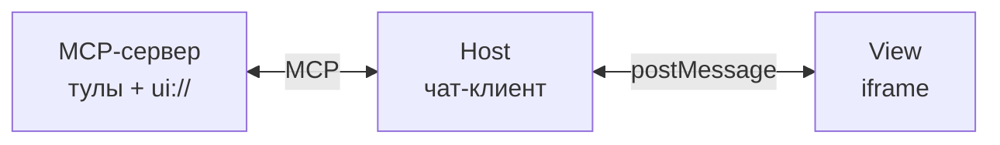
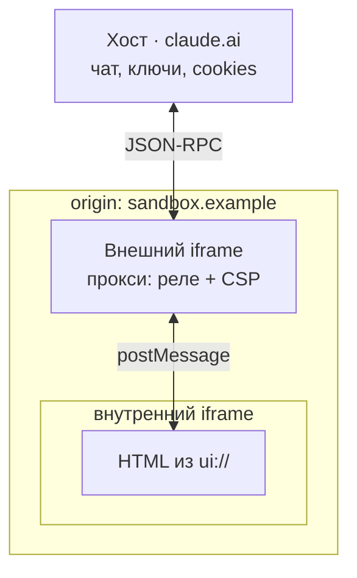

# Добро пожаловать<br>в новый веб с MCP Apps

Троицкий Роман · ПАО Сбербанк

<div class="repo">github.com/… · демо и слайды</div>

<!--
Пятнадцать секунд. Ссылку не проговаривать: она висит в углу весь доклад.

Меня зовут Роман Троицкий, я из Сбербанка. Сегодня — про то, чего вашему MCP-серверу не хватает, чтобы с ним могли работать и человек, и агент.
-->

---
layout: interjection
variant: 4
transition: fade
---

<TextBig>Демо</TextBig>

<div class="cue">Живой чат · обычный MCP-сервер магазина · ответ уже на экране</div>

<style scoped>
.cue { margin-top: 1.6rem; font-size: 1.5rem; color: var(--white-sub); }
</style>

<!--
Это не слайд, это браузер. Чат подключён к обычному MCP-серверу магазина. Ни ui://, ни skill://. Запрос набран заранее, ответ уже прогрет на экране.

Запрос простой: наушники для созвонов, до пятнадцати тысяч, к пятнице. Ответ — три абзаца текста с тремя моделями. Модели подобраны верно, цены названы верно, фактических ошибок в тексте нет.

Посмотрите, что человек делает дальше. Сравнить характеристики по трём абзацам он не может. Выбрать цвет тоже: про цвета агент не написал, в текст всё не влезает. Узнать, когда это приедет к нему в город, не может тем более.

Он открывает сайт магазина и проходит весь путь заново. Разговор с агентом сэкономил ему ноль.

Тридцать лет индустрия строила для человека интерфейсы прямого действия. Агенту мы выдали ленту строк и на этом остановились.

Стейдж-директ: окно с ответом прогрето до выхода на сцену. Скриншот того же ответа держать соседней вкладкой. Эта вкладка живёт до слайда 4.
-->

---

# Контракт тула

<div class="grid2">

<div class="tools">
<pre>search_products
get_product
list_variants
…</pre>
<div class="sub">на сервере — двадцать</div>
</div>

```json {all|3|4-10|11}{lines:true}
{
  "name": "search_products",
  "description": "Поиск по каталогу: категория, цена, рейтинг.",
  "inputSchema": {
    "properties": {
      "query":    { "type": "string" },
      "category": { "enum": ["headphones", "keyboards"] }
    },
    "required": ["query"]
  },
  "annotations": { "readOnlyHint": true }
}
```

</div>

<style scoped>
.grid2 { display: grid; grid-template-columns: 0.9fr 1.6fr; gap: 2rem; align-items: start; margin-top: 1.4rem; }
.tools pre { font-size: 1.5rem; line-height: 1.6; color: var(--color-cyan); }
.tools .sub { margin-top: 0.8rem; font-size: 1.2rem; }
.grid2 :deep(.slidev-code) { font-size: 1.05rem; }
</style>

<!--
Сервер магазина. Тулов здесь двадцать, показываю три и раскрываю один целиком: имя, описание, схема входа с типами и обязательными полями, аннотация. Контракт оформлен по всем правилам — тот, кто писал сервер, сделал свою работу хорошо. Плохой пример я не беру: на нём доказывать нечего.

[click] Вот описание. Модель это читает и понимает, что тул делает.

[click] Схема входа. Категория задана через enum, промахнуться нельзя. Поле query обязательное.

[click] Аннотация говорит, что тул только читает и ничего не меняет.

Двадцать таких карточек приезжают агенту при подключении и лежат в контексте на каждом запросе, включая те, где про возвраты и промокоды никто не спрашивал.
-->

---

# Провальный прогон

<div class="log">
  <div class="line" v-click="1"><span class="who">клиент</span> наушники для созвонов, до 15 000, к пятнице</div>
  <div class="line" v-click="2"><span class="call">search_products</span> → берёт первую по рейтингу</div>
  <div class="line" v-click="2"><span class="who">агент</span> «привезём к пятнице»</div>
  <div class="line bad" v-click="3">остаток в регионе клиента: <b>нет</b> · реальный срок: <b>9 дней</b></div>
  <div class="line bad" v-click="3"><span class="call">estimate_delivery</span> не вызван ни разу</div>
</div>

<div class="verdict" v-click="4">Схема соблюдена. Вызов валиден. Ответ неверный.</div>

<style scoped>
.log { margin-top: 1.6rem; display: flex; flex-direction: column; gap: 0.8rem; }
.line { font-size: 1.5rem; padding: 0.7rem 1.1rem; background: rgba(255,255,255,0.04); border-left: 3px solid rgba(255,255,255,0.2); }
.line .who { display: inline-block; min-width: 5.5rem; color: var(--white-sub); }
.line .call { color: var(--color-cyan); font-weight: 700; }
.line.bad { border-left-color: #ff5a5a; color: #ff9a9a; }
.line.bad b { color: #ff5a5a; }
.verdict { margin-top: 1.8rem; font-size: 2rem; font-weight: 800; }
</style>

<!--
[click] Запрос: наушники для созвонов, до пятнадцати тысяч, к пятнице.

[click] Агент зовёт search_products, берёт первую модель по рейтингу и обещает доставку к пятнице.

Пауза. Дать залу увидеть самому.

[click] Остатка этой модели в регионе клиента нет. Реальный срок — девять дней. estimate_delivery агент не позвал ни разу.

[click] Схема соблюдена. Вызов валидный. Ответ неверный.

Возврат к прогретой вкладке из демо: то самое обещание к пятнице — вот оно, неверное. Один непрерывный сюжет.
-->

---
layout: two-cols
variant: 11
leftWidth: 42%
align: top
---

::header::

# Граница ответственности

::default::

<div class="okcard" v-click="1">
  <div class="uri">estimate_delivery</div>
  <div class="ok">написано правильно</div>
</div>

::right::

<div class="qs">
  <div class="q" v-click="2">В каком порядке звать эти шесть тулов?</div>
  <div class="q" v-click="3">Что делать, если товара нет на локальном складе?</div>
  <div class="q" v-click="4">Рейтинг — это критерий выбора?</div>
  <div class="verdict" v-click="5">Схема отвечает на вопрос «что делает этот тул».</div>
</div>

<style scoped>
.okcard { margin-top: 1rem; padding: 1.4rem 1.6rem; border: 2px solid var(--color-green); border-radius: 12px; background: rgba(86,255,113,0.06); }
.okcard .uri { font-size: 1.9rem; font-weight: 700; color: var(--color-cyan); }
.okcard .ok { margin-top: 0.6rem; font-size: 1.3rem; color: var(--color-green); }
.qs { display: flex; flex-direction: column; gap: 1.1rem; }
.q { font-size: 1.7rem; font-weight: 600; padding-left: 1.2rem; border-left: 4px solid var(--dark-blue); }
.qs .verdict { margin-top: 0.8rem; font-size: 1.5rem; color: var(--white-sub); font-weight: 400; }
</style>

<!--
[click] Карточка estimate_delivery написана правильно, я её показывал минуту назад. Агент до неё не дошёл.

Знание, которого ему не хватило, звучит так: прежде чем называть срок, проверь остаток на складе в регионе клиента. Это знание не про вызов одного тула. Оно про порядок работы с шестью.

[click] В каком порядке звать эти шесть тулов?

[click] Что делать, если товара нет на локальном складе?

[click] Рейтинг — это критерий выбора?

[click] В схеме для этих вопросов нет места. Схема отвечает на вопрос «что делает этот тул», и отвечать на остальные не должна.

Сразу оговорюсь, чтобы снять вопрос из зала. Скилл не чинит кривой API. Если порядок вызовов обязателен и выражается схемой — выражайте схемой: обязательным полем, проверкой внутри тула, внятной ошибкой. Речь про знание, которое в схему не кладётся по своей природе: критерии выбора, что уточнить у клиента, границы обещаний.
-->

---

# Два ресурса

<div class="split">
  <div class="half" v-click="1">
    <div class="uri cyan"><code>ui://</code></div>
    <div class="fix">интерфейс для человека</div>
  </div>
  <div class="half" v-click="2">
    <div class="uri accent"><code>skill://</code></div>
    <div class="fix">инструкция для агента</div>
  </div>
</div>

<div class="foot" v-click="3">И то и другое — <b>resources</b> в MCP</div>

<style scoped>
.split { margin-top: 2.4rem; display: grid; grid-template-columns: 1fr 1fr; gap: 2rem; }
.half { padding: 2rem 1.8rem; border: 1px solid rgba(255,255,255,0.16); border-radius: 14px; background: rgba(255,255,255,0.04); }
.uri code { font-size: 2.6rem !important; font-weight: 800; background: transparent; }
.uri.cyan code { color: var(--color-cyan); }
.uri.accent code { color: var(--color-green); }
.fix { margin-top: 1.1rem; font-size: 1.7rem; font-weight: 700; }
.foot { margin-top: 2.2rem; font-size: 1.8rem; }
</style>

<!--
Дыры две, и они симметричны.

[click] Человек получил ответ и не может ничего с ним сделать. Закрывается интерфейсом — ui://.

[click] Агент получил список тулов и не знает, в каком порядке их звать. Закрывается инструкцией — skill://.

[click] Оба — обычные resources в MCP. Новых примитивов нет, ядро протокола никто не трогает.

Рабочая группа Skills Over MCP формулирует это так: скиллы — это контекст, а MCP — протокол контекста. Агент уже ходит на сервер за тулами. За инструкцией он может ходить туда же.

К этому слайду я вернусь в конце.
-->

---
layout: two-cols
variant: 11
leftWidth: 52%
align: center
---

::header::

# Три участника и жизненный цикл

::default::

<div v-click="1">



</div>

::right::

<div class="phases">
  <div class="ph" v-click="2"><span class="n">1</span><div><b>Подключение</b><br>хост забирает HTML-шаблон</div></div>
  <div class="ph" v-click="3"><span class="n">2</span><div><b>Вызов</b><br>модель зовёт тул, сервер отдаёт результат</div></div>
  <div class="ph" v-click="4"><span class="n">3</span><div><b>Рендер</b><br>iframe, тема, размеры, аргументы, результат</div></div>
  <div class="ph" v-click="5"><span class="n">4</span><div><b>Интерактив</b><br>виджет зовёт тулы обратно через хост</div></div>
</div>

<style scoped>
.phases { display: flex; flex-direction: column; gap: 0.9rem; }
.ph { display: flex; align-items: flex-start; gap: 1rem; font-size: 1.3rem; line-height: 1.35; }
.ph .n {
  flex: none; width: 2.2rem; height: 2.2rem; border-radius: 50%;
  display: grid; place-items: center; font-weight: 800; font-size: 1.2rem;
  background: var(--dark-blue); color: #fff;
}
.ph b { font-size: 1.4rem; }
:deep(.slidev-code) { font-size: 0.95rem; }
</style>

<!--
[click] Три участника. Сервер объявляет тулы и UI-ресурсы. Хост — это чат-клиент: он держит iframe и проксирует всё между сервером и виджетом. View — сам виджет внутри iframe. Сервер и хост говорят по MCP. Хост и View — через postMessage. Прямого канала между сервером и виджетом нет, к этому вернусь на слайде про песочницу.

Жизненный цикл в четыре фазы.

[click] При подключении хост забирает у сервера HTML-шаблон. До любого вызова тула, заранее.

[click] Пользователь спрашивает, модель зовёт тул, сервер возвращает результат.

[click] Хост поднимает iframe, отдаёт ему тему и размеры контейнера, потом аргументы тула и его результат.

[click] Пользователь работает с виджетом. Виджет может позвать тул обратно, через хост. Перед тем как убрать виджет с экрана, хост его предупреждает: можно сохранить состояние.
-->

---

# UI-ресурс объявлен заранее

<div class="chips gives" v-click="1">
  <span class="chip">префетч</span>
  <span class="chip">кеш</span>
  <span class="chip">ревью HTML до исполнения</span>
  <span class="chip">разметка ≠ данные</span>
</div>

<div class="rejected">
  <div class="rej" v-click="2"><s>embedded resources</s><span>хост не успевает отревьюить HTML, кешировать нечего</span></div>
  <div class="rej" v-click="3"><s>глобальный объект API</s><span>инъекция кода хоста в каждый фрейм; с внешними не работает</span></div>
  <div class="rej" v-click="4"><s>внешние URL</s><span>модель не видит содержимое, ревью не провести</span></div>
</div>

<style scoped>
.gives { margin-top: 1.4rem; }
.gives .chip { background: rgba(86,255,113,0.08); border-color: rgba(86,255,113,0.4); }
.rejected { margin-top: 2rem; display: flex; flex-direction: column; gap: 1rem; }
.rej { display: flex; align-items: baseline; gap: 1.4rem; }
.rej s { font-size: 1.6rem; font-weight: 700; color: #ff8a8a; min-width: 16rem; }
.rej span { font-size: 1.35rem; color: var(--white-sub); }
</style>

<!--
Шаблон приезжает при подключении. [click] Хост может его закешировать, отревьюить и подготовить заранее. Статичная разметка не смешивается с динамическими данными: префетч, кеш, ревью HTML до исполнения.

Три варианта авторы рассмотрели и отклонили. Это ответ на вопрос «почему не проще».

[click] Первый: возвращать UI прямо в результате тула, как делает mcp-ui сегодня. Сервер писать удобнее, зато хост не успевает отревьюить HTML до исполнения, и кешировать нечего.

[click] Второй: положить в iframe глобальный объект API. Отклонили: хосту пришлось бы инжектить свой код в каждый фрейм, а с внешними источниками это не работает.

[click] Третий: разрешить внешние URL. Отложили: модель не видит содержимое такой страницы, скриншот не снять, ревью не провести. Могут вернуть отдельной capability.
-->

---

# content и structuredContent

<div class="branch">
  <div class="root" v-click="1">результат тула</div>
  <div class="arms">
    <div class="arm" v-click="2">
      <div class="pipe cyan"><code>content</code></div>
      <div class="dst">→ контекст модели</div>
      <div class="det">три строки текста</div>
    </div>
    <div class="arm" v-click="3">
      <div class="pipe accent"><code>structuredContent</code></div>
      <div class="dst">→ виджет</div>
      <div class="det">20 моделей · характеристики · остатки · сроки</div>
    </div>
  </div>
  <div class="payoff" v-click="4">Контекст не раздувается. Пользователь видит таблицу.</div>
</div>

<style scoped>
.branch { margin-top: 1.4rem; }
.root { font-size: 1.6rem; font-weight: 700; text-align: center; padding: 0.8rem; border: 1px solid rgba(255,255,255,0.2); border-radius: 10px; max-width: 24rem; margin: 0 auto; }
.arms { margin-top: 1.6rem; display: grid; grid-template-columns: 1fr 1fr; gap: 2rem; }
.arm { padding: 1.4rem 1.6rem; border-radius: 12px; background: rgba(255,255,255,0.04); border: 1px solid rgba(255,255,255,0.12); }
.pipe code { font-size: 1.8rem !important; font-weight: 800; background: transparent; }
.pipe.cyan code { color: var(--color-cyan); }
.pipe.accent code { color: var(--color-green); }
.dst { margin-top: 0.7rem; font-size: 1.5rem; font-weight: 600; }
.det { margin-top: 0.6rem; font-size: 1.3rem; color: var(--white-sub); }
.payoff { margin-top: 1.8rem; font-size: 1.7rem; font-weight: 600; text-align: center; }
</style>

<!--
[click] Результат тула едет двумя потоками.

[click] content — текст, который попадает в контекст модели. Три строки.

[click] structuredContent — данные, которые попадают в виджет. Двадцать моделей с характеристиками, вариантами, остатками по складам и сроками доставки.

[click] В магазине это развязывает главный узел. Пользователь видит таблицу и сравнивает. Модель получает три строки текста и не платит контекстом за то, чего ей знать не нужно.
-->

---

# Обратный канал и visibility

<div class="chan" v-click="1">виджет &nbsp;→&nbsp; хост &nbsp;→&nbsp; сервер <span class="s">· JSON-RPC 2.0 поверх postMessage</span></div>

<div class="note" v-click="2">каждый вызов логируется · хост может требовать подтверждения</div>

<div class="vis" v-click="3"><code>"visibility": ["model", "app"]</code><span>по умолчанию</span></div>
<div class="vis hi" v-click="4"><code>"visibility": ["app"]</code><span>модель тул не видит вообще</span></div>

<div class="chips ex" v-click="5">
  <span class="chip">обновить срок</span>
  <span class="chip">пагинация</span>
  <span class="chip">переключение варианта</span>
</div>

<style scoped>
.chan { margin-top: 1.2rem; font-size: 1.8rem; font-weight: 700; }
.chan .s { font-size: 1.2rem; font-weight: 400; color: var(--white-sub); }
.note { margin-top: 1rem; font-size: 1.35rem; color: var(--white-sub); }
.vis { margin-top: 1.1rem; display: flex; align-items: baseline; gap: 1.2rem; }
.vis code { font-size: 1.6rem !important; background: rgba(255,255,255,0.05); padding: 0.3rem 0.8rem; border-radius: 6px; }
.vis span { font-size: 1.3rem; color: var(--white-sub); }
.vis.hi code { color: var(--color-green); border: 1px solid var(--color-green); }
.ex { margin-top: 1.4rem; }
</style>

<!--
[click] Виджет говорит с хостом через JSON-RPC поверх postMessage. Свой формат сообщений авторы не изобретали: типы tool, prompt, intent из mcp-ui свели к подмножеству обычного JSON-RPC.

[click] Каждый вызов из виджета логируется, проходит через хост, и хост может потребовать подтверждения у пользователя. Дальше деталь, которую мало кто знает. У тула есть поле visibility.

[click] По умолчанию оба значения — model и app.

[click] Если поставить только app, модель этот тул не увидит вообще.

[click] Кнопка «обновить срок доставки», пагинация, переключение варианта: виджет зовёт эти тулы сам, контекст модели остаётся чистым.
-->

---

# Код

```json {1-5|7-11|10|all}{lines:true}
{
  "uri": "ui://shop/compare",
  "name": "Сравнение наушников",
  "mimeType": "text/html;profile=mcp-app"
}

{
  "name": "compare_products",
  "inputSchema": { "properties": { "product_ids": {} } },
  "_meta": { "ui": { "resourceUri": "ui://shop/compare" } }
}
```

<div class="foot">Внутри iframe — обычный HTML. Тему и размеры хост отдаёт сам.</div>

<style scoped>
:deep(.slidev-code) { font-size: 1.1rem; margin-top: 0.6rem; }
.foot { margin-top: 1.4rem; font-size: 1.4rem; color: var(--white-sub); }
</style>

<!--
Весь диф сервера. Объявляем ресурс: URI со схемой ui://, имя, MIME-тип.

[click] Тул ссылается на ресурс.

[click] Через _meta, вот эта строка.

[click] Всё вместе. Внутри iframe обычный HTML. Тему и размеры контейнера хост отдаст сам при инициализации.

Свериться перед докладом. mimeType — text/html;profile=mcp-app; в ноябрьском анонсе был text/html+mcp. _meta — вложенный объект; в ноябре был плоский ключ ui/resourceUri. Источник истины: modelcontextprotocol/ext-apps, каталог 2026-01-26. В статусе release candidate висит спека 2026-07-28.
-->

---
layout: interjection
variant: 5
transition: fade
---

<TextBig>Демо · ui://</TextBig>

<div class="cue">тот же сервер, тот же запрос — плюс один ресурс</div>

<style scoped>
.cue { margin-top: 1.6rem; font-size: 1.5rem; color: var(--white-sub); }
</style>

<!--
Пять тактов, две с половиной минуты. Возврат в ту же вкладку, где на слайде 2 был текстовый ответ.

Такт 1. Тот же сервер, тот же запрос. Я добавил один ресурс и одну строку в метаданные тула compare_products. Вместо трёх абзацев в чате рисуются карточки сравнения: три модели, характеристики в строках, вариант, цена, срок доставки.

Такт 2. Я переключаю комплектацию. Данные пересчитались, к модели никто не обращался, токены не потрачены. Это тот самый visibility: app. Тул select_variant объявлен видимым только приложению. Переключение цвета не событие для контекста разговора. В текстовом чате каждое такое движение стоило бы полного круга через модель.

Такт 3. Срок доставки виджет показывает для региона клиента, а не для склада по умолчанию. Данные приехали в structuredContent: остатки по всем складам, сроки, варианты. В контекст модели ушло три строки.

Такт 4. Жму «в корзину». Нажатие в чужом HTML не кладёт товар в корзину — оно просит хост это сделать. Виджет отправил JSON-RPC через postMessage, хост показал запрос на подтверждение и только после согласия вызвал тул. Сам виджет в сеть не ходил. Модель осталась в петле: видит результат и продолжает разговор.

Такт 5. Открываю DevTools, вкладку Elements. Фреймов два: внешний на отдельном домене, внутри него второй с нашим HTML. Вот сообщения между ними — обычный JSON-RPC. Два фрейма — не случайность. Сейчас покажу, откуда они берутся.

Стейдж-директ: видео всех пяти тактов записать заранее, держать в соседней вкладке. DevTools открыть до выхода на сцену. Если время поджимает — такт 3 убирается, такт 5 не убирается.
-->

---

# Границы

<div class="rules">
  <div class="rule" v-click>sandboxed iframe: ни DOM хоста, ни cookies, ни storage</div>
  <div class="rule" v-click>сети нет по умолчанию · домены в CSP, хост их применяет</div>
  <div class="rule" v-click>связь только через postMessage · аудируемые JSON-RPC</div>
  <div class="rule" v-click>хост может требовать подтверждения на любой вызов</div>
  <div class="rule" v-click>хосты без расширения показывают обычный текст</div>
</div>

<div class="hook" v-click>Два фрейма из DevTools — сейчас разберём, откуда они.</div>

<style scoped>
.rules { margin-top: 1.4rem; display: flex; flex-direction: column; gap: 0.8rem; }
.rule { font-size: 1.55rem; font-weight: 500; padding: 0.7rem 1.2rem; border-left: 4px solid var(--dark-blue); background: rgba(255,255,255,0.03); }
.hook { margin-top: 1.6rem; font-size: 1.6rem; font-weight: 700; color: var(--color-green); }
</style>

<!--
Пять правил, быстро, без разбора.

[click] Виджет живёт в sandboxed iframe: ни DOM хоста, ни его cookies, ни storage.

[click] Сети у виджета нет по умолчанию. Сервер декларирует домены в CSP-метаданных, хост их применяет. Ничего не задекларировал — исходящих соединений не будет.

[click] Связь только через postMessage, аудируемыми сообщениями. Вы их только что видели в консоли.

[click] Хост может требовать подтверждения на любой вызов тула из виджета. Диалог, который выскочил на «в корзину», — это оно.

[click] Хосты без расширения покажут обычный текст. Текстовый фолбэк пишется в сервере с первого дня.

[click] Пункт первый я и разберу: sandboxed iframe, которых оказалось два.
-->

---

# Почему iframe в iframe

<div class="cond" v-click="1">HTML приезжает <b>строкой</b> · <code>srcdoc</code> и blob наследуют origin родителя</div>

<table class="fork">
  <tbody>
    <tr v-click="2"><td class="fl">без allow-scripts</td><td>виджет мёртв: ни JS, ни интерактива</td></tr>
    <tr v-click="3" class="bad"><td class="fl">scripts + same-origin</td><td>песочницы нет: cookies, storage; скрипт снимает sandbox с себя</td></tr>
    <tr v-click="4"><td class="fl">scripts без same-origin</td><td>opaque origin: ни storage, ни cookies, ни однооригинных запросов</td></tr>
  </tbody>
</table>

<div class="out" v-click="5">Выход: увести гостя на <b>другой origin</b></div>

<style scoped>
.cond { margin-top: 1.2rem; font-size: 1.5rem; line-height: 1.4; }
.cond code { color: var(--color-cyan); }
.fork { margin-top: 1.6rem; border-collapse: collapse; font-size: 1.4rem; width: 100%; }
.fork td { padding: 0.9rem 1.2rem; border: 1px solid rgba(255,255,255,0.1); vertical-align: top; }
.fork .fl { font-weight: 700; color: var(--color-cyan); white-space: nowrap; }
.fork tr.bad td { color: #ff9a9a; }
.fork tr.bad .fl { color: #ff5a5a; }
.out { margin-top: 1.6rem; font-size: 1.7rem; font-weight: 700; color: var(--color-green); }
</style>

<!--
HTML приезжает по MCP строкой, а не ссылкой. [click] Отрисовать строку можно через srcdoc или blob-URL. Оба наследуют origin родителя, то есть origin самого хоста. Origin — это источник: схема, домен, порт. Дальше вилка по атрибуту sandbox, и обе ветки плохие.

[click] Убираем allow-scripts — виджет мёртв. Ни JS, ни интерактивности, показывать нечего.

[click] Ставим allow-scripts вместе с allow-same-origin — песочницы больше нет. Скрипт получает origin хоста: parent.document, cookies, localStorage. Он снимает атрибут sandbox с самого себя в родительском DOM и перезагружается уже без ограничений. Это записано прямым предупреждением в спецификации HTML и в MDN.

[click] Ставим allow-scripts без allow-same-origin — безопасно, но фрейм получает opaque origin. Ни storage, ни cookies, ни однооригинных запросов. Половина фронтенд-кода на этом ломается.

[click] Выход один: увести гостя на другой origin. Тогда allow-same-origin можно давать спокойно: «свой origin» для гостя — домен песочницы, а не домен хоста.
-->

---
layout: two-cols
variant: 11
leftWidth: 52%
align: center
---

::header::

# Внешний фрейм — прокси

::default::

<div v-click="1">



</div>

::right::

<div class="gives">
  <div class="g" v-click="2">граница origin</div>
  <div class="g" v-click="3">применение CSP по метаданным ресурса</div>
  <div class="g" v-click="4">нормализация JSON-RPC до хоста</div>
  <div class="note" v-click="5">Гость хоста не видит. Он видит прокси.</div>
</div>

<style scoped>
.gives { display: flex; flex-direction: column; gap: 1.1rem; }
.g { font-size: 1.5rem; font-weight: 600; padding-left: 1.2rem; border-left: 4px solid var(--dark-blue); }
.gives .note { margin-top: 1rem; font-size: 1.6rem; font-weight: 700; color: var(--color-green); border: none; padding: 0; }
:deep(.slidev-code) { font-size: 0.8rem; }
</style>

<!--
[click] Другой origin нужно чем-то создать. Отсюда внешний фрейм, загруженный с отдельного домена, а внутри него гостевой фрейм с нашим HTML.

Внешний фрейм даёт три вещи.

[click] Границу origin.

[click] Применение CSP по метаданным ресурса, включая список разрешённых доменов.

[click] Нормализацию JSON-RPC до того, как сообщение дойдёт до хоста.

[click] Гость хоста не видит. Он видит прокси.

Про точность: спека требует sandboxed iframe, аудируемых JSON-RPC и применения CSP. Двойной фрейм — это то, как хосты выполняют требование; у MCPJam Inspector он задокументирован именно так. Те два фрейма из DevTools — это внешний прокси и гость. Одним iframe безопасно не получается.
-->

---

# Куда положить процедуру

<div class="qs" v-click="1">
  в каком порядке звать тулы · что делать, если товара нет
</div>

<div class="tries">
  <div class="try" v-click="2">
    <div class="head"><s>в <code>description</code> тула</s></div>
    <div class="why">поле принадлежит одному тулу, знание живёт между шестью</div>
  </div>
  <div class="try" v-click="3">
    <div class="head"><s>в <code>instructions</code> сервера</s></div>
    <div class="why">грузятся раз при инициализации · 140 строк туда не положат</div>
  </div>
</div>

<style scoped>
.qs { margin-top: 1.2rem; font-size: 1.5rem; color: var(--white-sub); }
.tries { margin-top: 2rem; display: flex; flex-direction: column; gap: 1.4rem; }
.try { padding: 1.2rem 1.5rem; border-left: 4px solid #ff5a5a; background: rgba(255,255,255,0.03); }
.try .head { font-size: 1.7rem; font-weight: 700; color: #ff8a8a; }
.try .head code { color: #ff8a8a; background: transparent; }
.try .why { margin-top: 0.5rem; font-size: 1.4rem; color: var(--white-sub); }
</style>

<!--
Знание есть, места для него нет. [click] Вопросы те же, что на слайде про границу ответственности: в каком порядке звать тулы, что делать, если товара нет. Разберём два очевидных варианта, куда его положить.

[click] Первый: написать в description. В description какого тула? Правило «проверь остаток, прежде чем называть срок» не про estimate_delivery и не про check_stock. Оно про связку между ними. Поле принадлежит одному тулу, а знание живёт между шестью.

[click] Второй: написать в instructions сервера. Инструкции сервера грузятся один раз, при инициализации. Обновил процедуру — переподключай сервер. И размер: моя процедура занимает сто сорок строк. В инструкцию сервера её никто не положит.

Оба варианта платят одним и тем же: текст висит в контексте постоянно, для всех запросов, включая те, где он не нужен.
-->

---

# Четыре ограничения

<div class="limits">
  <div class="lim" v-click><span class="n">1</span><div>инструкции сервера грузятся только на инициализации<br><span class="sub">новый или обновлённый скилл — переподключение</span></div></div>
  <div class="lim" v-click><span class="n">2</span><div>сложные процедуры не влезают в размер инструкции<br><span class="sub">сотни строк markdown со ссылками на файлы</span></div></div>
  <div class="lim" v-click><span class="n">3</span><div>нет discovery<br><span class="sub">пользователь не знает, что к серверу есть скилл</span></div></div>
  <div class="lim" v-click><span class="n">4</span><div>оркестрация через несколько серверов<br><span class="sub">description принадлежит одному тулу на одном сервере</span></div></div>
</div>

<style scoped>
.limits { margin-top: 1.4rem; display: grid; grid-template-columns: 1fr 1fr; gap: 1.2rem 2rem; }
.lim { display: flex; gap: 1rem; align-items: flex-start; font-size: 1.4rem; line-height: 1.35; }
.lim .n { flex: none; width: 2.2rem; height: 2.2rem; border-radius: 50%; display: grid; place-items: center; font-weight: 800; background: var(--dark-blue); color: #fff; }
.lim .sub { color: var(--white-sub); font-size: 1.2rem; }
</style>

<!--
Это не мой список. Так рабочая группа Skills Over MCP формулирует проблему в своём репозитории.

[click] Первое. Инструкции сервера приезжают один раз, на инициализации. Обновил процедуру — переподключайся.

[click] Второе. Сложные процедуры не влезают в разумный размер инструкции. Речь про сотни строк markdown, которые ещё и ссылаются на приложенные файлы.

[click] Третье. Discovery нет вообще. Человек ставит MCP-сервер и не знает, что к нему существует скилл, который надо поставить отдельно.

[click] Четвёртое. Скиллу может понадобиться скоординировать тулы с нескольких серверов: магазин, доставка, платёжный провайдер. Ни одно поле description этого не выразит: оно принадлежит одному тулу на одном сервере. Формулировка рабочей группы: описание тула говорит, что тул делает, а не как оркестрировать несколько тулов ради цели.
-->

---
layout: two-cols
variant: 11
leftWidth: 50%
align: center
---

::header::

# Анатомия скилла

::default::

<div v-click="1">

```
purchase-flow/
├── SKILL.md          ← фронтматтер + процедура
├── references/
│   └── delivery-rules.md
├── examples/
│   └── out-of-stock.md
└── scripts/          ← в MCP не исполняются
```

</div>

::right::

<div class="prog">
  <div class="p" v-click="2"><b>фронтматтер</b><br>name · description</div>
  <div class="p" v-click="3">в контексте постоянно — только <b>две строки</b></div>
  <div class="p" v-click="4">тело (140 строк) приезжает при попадании в сценарий</div>
</div>

<style scoped>
:deep(.slidev-code) { font-size: 0.95rem; }
.prog { display: flex; flex-direction: column; gap: 1.2rem; }
.p { font-size: 1.45rem; line-height: 1.4; padding-left: 1.2rem; border-left: 4px solid var(--dark-blue); }
</style>

<!--
[click] Скилл — это директория. SKILL.md с YAML-фронтматтером обязателен, рядом могут лежать справочники, примеры, скрипты. Формат придумали не в MCP: спека Agent Skills уже описывает фронтматтер, правила именования и модель прогрессивного раскрытия. MCP работает транспортом и в содержимое не лезет.

[click] Фронтматтер — имя и описание.

[click] Прогрессивное раскрытие: в контексте постоянно висят имя и описание, две строки.

[click] Полный текст, сто сорок строк, приезжает тогда, когда клиент действительно пришёл за наушниками. Про scripts скажу отдельно на последнем слайде блока.
-->

---

# Как хост находит и грузит

<div class="flow">
  <div class="node" v-click="1"><code>resources/read skill://index.json</code><span>каталог: name · description · url</span></div>
  <div class="node" v-click="2">хост решает, как показать модели<span>системный промпт · тул чтения · локальная ФС</span></div>
  <div class="fork">
    <div class="branch no" v-click="3"><b>запрос мимо</b><span>тело не грузится · контекст чист</span></div>
    <div class="branch yes" v-click="4"><b>запрос в сценарии</b><span>resources/read SKILL.md → модель идёт по процедуре</span></div>
  </div>
  <div class="cav" v-click="5">index.json необязателен · базовый механизм — прямая читаемость URI</div>
</div>

<style scoped>
.flow { margin-top: 1.2rem; display: flex; flex-direction: column; gap: 0.9rem; }
.node { padding: 0.9rem 1.2rem; background: rgba(255,255,255,0.04); border: 1px solid rgba(255,255,255,0.12); border-radius: 10px; font-size: 1.4rem; font-weight: 600; }
.node code { color: var(--color-cyan); background: transparent; font-size: 1.3rem !important; }
.node span { display: block; margin-top: 0.3rem; font-weight: 400; font-size: 1.2rem; color: var(--white-sub); }
.fork { display: grid; grid-template-columns: 1fr 1fr; gap: 1.4rem; }
.branch { padding: 0.9rem 1.2rem; border-radius: 10px; font-size: 1.35rem; }
.branch b { font-size: 1.45rem; }
.branch span { display: block; margin-top: 0.3rem; font-size: 1.2rem; color: var(--white-sub); }
.branch.no { border: 1px solid rgba(255,255,255,0.14); }
.branch.yes { border: 1px solid var(--color-green); background: rgba(86,255,113,0.06); }
.cav { margin-top: 0.4rem; font-size: 1.35rem; color: var(--white-sub); }
</style>

<!--
Discovery ведёт хост, не модель. [click] На старте он тянет index.json со всех подключённых серверов и получает каталог: имя, описание, где лежит.

[click] Дальше хост сам решает, как показать это модели: инжектнуть метаданные в системный промпт, дать модели тул чтения, или записать скиллы в локальную ФС. Прототип для Claude Code делает первое. Спека сознательно не требует файловой системы.

[click] Если запрос мимо сценария — тело не грузится, контекст чист.

[click] Если запрос в сценарии — resources/read тела, и модель идёт по процедуре.

[click] Оговорка, которую я сам сначала понял неправильно. index.json не обязателен. Базовый механизм — прямая читаемость: URI скилла всегда валидный аргумент resources/read. Каталог — надстройка. Документационный сервер отдаст тысячи скиллов, шлюз не знает границ. Отсюда требование к хосту: пустое перечисление не доказывает отсутствие скиллов.
-->

---

# Процедура для магазина

<div class="proc">
  <div class="grp" v-click="1"><span class="s">?</span><div>регион и дедлайн — <b>до</b> подбора</div></div>
  <div class="grp" v-click="2"><span class="s">1</span><div>search_products · list_variants</div></div>
  <div class="grp bad" v-click="3"><span class="s">2</span><div>check_stock по региону — <b>до</b> estimate_delivery <span>тот самый пропущенный шаг</span></div></div>
  <div class="grp" v-click="4"><span class="s">3</span><div>успеваем к дедлайну? нет → пункт выдачи или альтернатива с локального склада</div></div>
  <div class="grp" v-click="5"><span class="s">4</span><div>add_to_cart → виджет · create_order после подтверждения</div></div>
</div>

<style scoped>
.proc { margin-top: 1.2rem; display: flex; flex-direction: column; gap: 0.9rem; }
.grp { display: flex; align-items: flex-start; gap: 1.1rem; font-size: 1.5rem; line-height: 1.35; }
.grp .s { flex: none; width: 2.4rem; height: 2.4rem; border-radius: 50%; display: grid; place-items: center; font-weight: 800; background: var(--dark-blue); color: #fff; font-size: 1.3rem; }
.grp span { display: block; font-size: 1.15rem; color: var(--white-sub); margin-top: 0.2rem; }
.grp.bad .s { background: #d33; }
.grp.bad { color: #ff9a9a; }
.grp.bad b { color: #ff5a5a; }
</style>

<!--
Вот процедура, которой не хватило агенту на провальном прогоне.

[click] Регион и дедлайн спрашиваются до подбора. Наушники к пятнице в Москве и в Иркутске — разные наушники.

[click] Подбор: search_products, раскрываем варианты.

[click] check_stock вызывается до estimate_delivery, всегда. Без него estimate_delivery вернёт срок склада по умолчанию, и агент пообещает пятницу. Ровно это вы видели.

[click] Ветка «не успеваем» не молчит и не подбирает заново втихую. Она показывает пункт выдачи, если он ближе по сроку, или предлагает модель того же назначения с локального склада, и называет разницу вслух.

[click] Последний шаг — ссылка из скилла на виджет. create_order вызывается после того, как человек нажал кнопку. Скилл учит агента довести до виджета, виджет спрашивает человека.
-->

---

# Код

```markdown {1-4|6-8|11-12}{lines:true}
---
name: purchase-flow
description: Подбор и оформление с проверкой сроков.
---
## Порядок
3. check_stock с регионом. Обязательно до шага 4.
4. estimate_delivery. Без шага 3 — срок склада.
5. Не успеваем → list_pickup_points либо альтернатива.

## Чего не делать
- Не называть срок без check_stock.
- Не выдавать рейтинг за критерий подбора.
```

<div class="note">пункт 4 объясняет промах · «чего не делать» работает не хуже «что делать»</div>

<style scoped>
:deep(.slidev-code) { font-size: 1rem; }
.note { margin-top: 1.2rem; font-size: 1.35rem; color: var(--white-sub); }
</style>

<!--
Фронтматтер: имя и описание. Эти две строки висят в контексте модели, остальное грузится по требованию.

[click] Дальше процедура. Пункт четвёртый — ядро всего демо. Он объясняет, почему агент промахнулся, притом что все описания тулов написаны правильно.

[click] Раздел «чего не делать» работает не хуже раздела «что делать». Рейтинг — справка, а не критерий. Срок — оценка перевозчика, а не гарантия.
-->

---

# index.json

```json {lines:false}
{
  "skills": [{
    "name": "purchase-flow",
    "description": "Подбор и оформление заказа",
    "url": "skill://shop/purchase-flow/SKILL.md",
    "type": "skill-md"
  }]
}
```

<div class="note" v-click>на слайде 10 строк · в файле — 140. В <code>description</code> их никто не положит.</div>

<style scoped>
:deep(.slidev-code) { font-size: 1rem; }
.note { margin-top: 1.8rem; font-size: 1.5rem; font-weight: 700; color: var(--color-green); }
.note code { color: var(--color-green); background: transparent; }
</style>

<!--
Каталог: имя, описание, где лежит тело. На сервере это регистрируется как обычный ресурс. В FastMCP скилл вешается декоратором @mcp.resource() под своим URI, и всё. Так сделан, например, скилл IPInfo: skill://ipinfo/usage, а в инструкциях сервера написано прочитать его прежде, чем звать тулы.

[click] Прокручиваю. Здесь сто сорок строк, а на слайде десять. Никто и никогда не положит их в description.
-->

---

# Границы

<div class="rules">
  <div class="rule" v-click>скиллы поверх MCP — только инструктор<span>скилл, исполняющий код, выведен за скобки</span></div>
  <div class="rule" v-click>многофайловые скиллы едут архивом (zip, tar)<span>а не пофайловым resources/read</span></div>
  <div class="rule" v-click>хост не исполняет ничего локально без явного согласия<span>ни хуков, ни pre/post-скриптов, ни шелл-команд</span></div>
</div>

<style scoped>
.rules { margin-top: 1.6rem; display: flex; flex-direction: column; gap: 1.2rem; }
.rule { font-size: 1.6rem; font-weight: 600; padding: 0.9rem 1.3rem; border-left: 4px solid var(--dark-blue); background: rgba(255,255,255,0.03); }
.rule span { display: block; margin-top: 0.4rem; font-size: 1.3rem; font-weight: 400; color: var(--white-sub); }
</style>

<!--
Три границы, быстро.

[click] Область применения: только инструктор. Скилл, который учит агента текстом. Скилл-хелпер, исполняющий код на машине пользователя, рабочая группа вывела за скобки решением от четырнадцатого февраля.

[click] Многофайловые скиллы едут архивом, целиком, а не по одному файлу через resources/read.

[click] Скрипты из скилла, приехавшего по MCP, хост локально не исполняет без явного согласия. Ни хуков, ни pre- и post-скриптов, ни шелл-команд во фронтматтере. Microsoft пошла дальше: скрипты из архивных скиллов не исполняются никогда.
-->

---
layout: interjection
variant: 6
transition: fade
---

<TextBig>Демо · skill://</TextBig>

<div class="cue">главный экран — лог вызовов, чат вторичен</div>

<style scoped>
.cue { margin-top: 1.6rem; font-size: 1.5rem; color: var(--white-sub); }
</style>

<!--
Пять тактов, две с половиной минуты. Рядом открыт лог вызовов — он здесь главный экран.

Такт 1. Я добавил на сервер один каталог и один markdown-файл. Тулы не менялись: вот tools/list, он тот же, двадцать тулов, ни одного нового.

Такт 2. Отправляю тот же запрос: наушники к пятнице. Смотрите на лог, а не на чат. Агент прочитал каталог, нашёл подходящий скилл, прочитал тело. Дальше идёт по процедуре: ищет, раскрывает варианты, проверяет остаток по региону клиента, и только теперь спрашивает срок. Срок — девять дней, к пятнице не успевает. Агент уходит в ветку, которую я написал: пункт выдачи или альтернатива с локального склада. Тот же вопрос, тот же сервер, другой ответ.

Такт 3. Два лога рядом. Слева — начало доклада: один вызов и обещание, которое магазин не сдержит. Справа — шесть вызовов в правильном порядке. Разница — сто сорок строк markdown на сервере.

Такт 4. Правлю процедуру на живом сервере: при дедлайне меньше трёх дней сразу показывай пункты выдачи. Сохраняю. Сервер не перезапускал, клиент не переподключался. Следующий запрос — и агент ведёт себя по новому правилу. Вот это description не может физически.

Такт 5. Агент доводит до виджета. Виджет показывает пункты выдачи с картой, жму «оформить» — хост спрашивает подтверждение. Скилл научил агента, что делать, виджет спросил человека. Один сервер, два ресурса, обе аудитории.

Стейдж-директ: провал без скилла должен воспроизводиться; если промахивается через раз — показать оба прогона, не подкручивать промпт. Лог настроить читаемым с последнего ряда. Видео пяти тактов записать заранее.
-->

---

# Осень 2025: развилка

<div class="fork2">
  <div class="side" v-click="1">
    <div class="nm cyan">mcp-ui</div>
    <div class="who">Ido Salomon · Liad Yosef</div>
    <div class="d">своя схема сообщений · UI в результате тула</div>
    <div class="adopt" v-click="2">Postman · Shopify · Hugging Face · Goose · ElevenLabs</div>
  </div>
  <div class="side" v-click="3">
    <div class="nm accent">OpenAI Apps SDK</div>
    <div class="who">6 октября 2025 · DevDay</div>
    <div class="d">тот же MCP под капотом · своя реализация</div>
  </div>
</div>

<div class="bottom" v-click="4">два несовместимых способа делать одно и то же</div>

<style scoped>
.fork2 { margin-top: 1.4rem; display: grid; grid-template-columns: 1fr 1fr; gap: 2rem; }
.side { padding: 1.4rem 1.6rem; border: 1px solid rgba(255,255,255,0.14); border-radius: 12px; background: rgba(255,255,255,0.04); }
.nm { font-size: 2rem; font-weight: 800; }
.who { margin-top: 0.5rem; font-size: 1.35rem; color: var(--white-sub); }
.d { margin-top: 0.8rem; font-size: 1.4rem; }
.adopt { margin-top: 1rem; font-size: 1.25rem; color: var(--white-sub); }
.bottom { margin-top: 1.8rem; font-size: 1.8rem; font-weight: 700; }
</style>

<!--
Осенью прошлого года двое разработчиков, Идо Саломон и Лиад Йосеф, сделали mcp-ui. [click] Сообщество, свой протокол сообщений, UI приезжает прямо в результате тула.

[click] Проект взлетел: Postman, Shopify, Hugging Face, Goose, ElevenLabs.

[click] Шестого октября OpenAI на DevDay показывает Apps SDK. Под капотом тот же MCP, реализация своя.

[click] Дальше знакомая картина: два несовместимых способа сделать одно и то же, и разработчик сервера пишет адаптеры под каждый хост.

Здесь могу признаться. Свой первый MCP-сервер я собрал на сорок тулов и был уверен, что подробные описания закрывают вопрос. Поэтому доклад и начинается с того слайда.
-->

---

# Слияние

<div class="merge">
  <div class="ev" v-click="1"><b>21 ноября 2025</b> · SEP-1865<span>Anthropic + OpenAI + мейнтейнеры mcp-ui</span></div>
  <div class="ev" v-click="2">предобъявленный ресурс · JSON-RPC вместо своего формата · обязательный sandbox</div>
  <div class="ev" v-click="3"><b>26 января 2026</b> · первое официальное расширение MCP<span>io.modelcontextprotocol/ui</span></div>
  <div class="ev" v-click="4">ChatGPT · Claude · VS Code · Goose</div>
</div>

<style scoped>
.merge { margin-top: 1.4rem; display: flex; flex-direction: column; gap: 1.1rem; }
.ev { font-size: 1.6rem; font-weight: 600; padding-left: 1.3rem; border-left: 4px solid var(--dark-blue); }
.ev b { color: var(--color-cyan); }
.ev span { display: block; margin-top: 0.3rem; font-size: 1.3rem; font-weight: 400; color: var(--white-sub); }
</style>

<!--
[click] Двадцать первого ноября случается то, чего в такой ситуации обычно не случается. Anthropic, OpenAI и мейнтейнеры mcp-ui садятся вместе и публикуют SEP-1865. Не «мы сделали свой стандарт», а слияние двух живых экосистем в одну спеку. В авторах — core-мейнтейнеры MCP из OpenAI и Anthropic, и оба автора mcp-ui.

[click] Ключевые решения вы уже видели. Ресурс объявляется заранее, а не приезжает в результате тула. Свой формат сообщений выбросили в пользу обычного JSON-RPC. Песочница обязательна.

[click] Двадцать шестого января MCP Apps выезжает как первое официальное расширение MCP. Идентификатор io.modelcontextprotocol/ui.

[click] Рендерят ChatGPT, Claude, VS Code, Goose. mcp-ui при этом никуда не делся: остался рекомендованным клиентским SDK.
-->

---

# Спор про скиллы

<div class="debate">
  <div class="col" v-click="1"><div class="sep cyan">SEP-2076</div><div>первоклассный примитив · skills/list · skills/get · свои capabilities</div></div>
  <div class="arg" v-click="2">за: ресурсы application-controlled, а скилл model-controlled по природе</div>
  <div class="col" v-click="3"><div class="sep accent">SEP-2640</div><div>расширение поверх Resources · ядро протокола не трогаем</div></div>
  <div class="win" v-click="4">победила вторая линия · PR-2076 закрыт</div>
  <div class="cost" v-click="5">размен: проблему активации так и не решили</div>
</div>

<style scoped>
.debate { margin-top: 1.2rem; display: flex; flex-direction: column; gap: 1rem; }
.col { padding: 1rem 1.3rem; border: 1px solid rgba(255,255,255,0.14); border-radius: 10px; background: rgba(255,255,255,0.04); font-size: 1.4rem; }
.sep { font-size: 1.6rem; font-weight: 800; }
.arg { font-size: 1.35rem; color: var(--white-sub); padding-left: 1.3rem; }
.win { font-size: 1.55rem; font-weight: 700; }
.cost { font-size: 1.5rem; font-weight: 700; color: var(--color-green); }
</style>

<!--
Со скиллами история другая, в ней был настоящий спор. Расскажу, потому что он объясняет, почему у скиллов до сих пор шероховато.

[click] Первое предложение, SEP-2076: сделать скиллы полноценным примитивом. Свои методы skills/list и skills/get, свои capabilities, всё как у тулов.

[click] Аргумент был сильный. Ресурсы в MCP по умолчанию application-controlled: решение прочитать принимает хост. А скилл, который учит агента оркестрировать тулы, по природе model-controlled — агент должен сам решить, что ему нужна инструкция.

[click] Победила другая линия, SEP-2640: расширение поверх Resources. Ядро протокола не трогаем, любой существующий сервер апгрейдится за вечер.

[click] PR-2076 закрыт.

[click] Что мы за это отдали. Проблему активации так и не решили. Модель не выбирает скилл сама, за неё это делает хост.
-->

---
layout: two-cols
variant: 11
leftWidth: 44%
align: top
---

::header::

# Что не работает и где мы сейчас

::default::

<div class="bad" v-click="1">
  <div class="h">модели ленивы</div>
  <div>агент игнорирует скилл, идёт в тулы, падает, потом читает</div>
  <div class="fix">лечит строка в instructions: «сначала прочитай скилл»</div>
</div>

::right::

<div class="good" v-click="2">
  <div class="h">кто уже сделал</div>
  <div class="chips">
    <span class="chip">FastMCP 3.0</span>
    <span class="chip">Microsoft Agent Framework</span>
    <span class="chip">GitHub MCP</span>
    <span class="chip">Mintlify</span>
    <span class="chip">Apify</span>
  </div>
</div>

<div class="status" v-click="3">Apps — продакшен с 26 января · Skills — SEP-2640, pending</div>

<style scoped>
.bad { padding: 1.2rem 1.4rem; border-left: 4px solid #ff5a5a; background: rgba(255,255,255,0.03); }
.bad .h { font-size: 1.7rem; font-weight: 700; color: #ff8a8a; }
.bad div { font-size: 1.35rem; margin-top: 0.5rem; }
.bad .fix { color: var(--white-sub); }
.good .h { font-size: 1.6rem; font-weight: 700; margin-bottom: 0.9rem; }
.good .chip { font-size: 1.15rem; padding: 0.5rem 1rem; }
.status { margin-top: 1.6rem; font-size: 1.45rem; font-weight: 600; color: var(--color-green); }
</style>

<!--
Честно про то, что не работает.

[click] Боб Дикинсон на своём инструменте наблюдал: агент видит доступный скилл, игнорирует его и лезет прямо в тулы. Падает несколько раз. И только потом читает инструкцию. Помогла строка в instructions сервера: сначала прочитай скилл.

[click] При этом скиллы поверх MCP — не бумага. FastMCP отдаёт их штатно. Microsoft встроила в Agent Framework, для .NET и Python. GitHub MCP Server подтягивает скиллы из репозиториев. Mintlify отдаёт и через well-known, и как MCP-ресурсы. Прототипы хостов есть в gemini-cli, goose, codex, Claude Code.

[click] Статус на сегодня. MCP Apps — продакшен, работает с двадцать шестого января. Skills over MCP — SEP-2640, всё ещё pending. Половина моего доклада — то, что можно катить завтра. Половина — то, за чем надо следить.
-->

---

# Что чем закрывать

<table class="dec">
  <tbody>
    <tr v-click="1"><td class="need">данные меняются между вызовами</td><td class="use"><b class="cyan">tool</b> · детерминированный вызов по схеме</td></tr>
    <tr v-click="2"><td class="need">знание стабильно: «как пользоваться сервером»</td><td class="use"><b class="accent">skill://</b> · текст, модель может понять неправильно</td></tr>
    <tr v-click="3"><td class="need">человек выбирает, сравнивает, подтверждает</td><td class="use"><b>ui://</b> поверх тула</td></tr>
  </tbody>
</table>

<div class="trade" v-click="4">размен: скилл правится словами — ценой недетерминированности</div>

<style scoped>
.dec { margin-top: 1.4rem; border-collapse: collapse; font-size: 1.5rem; width: 100%; }
.dec td { padding: 1rem 1.3rem; border: 1px solid rgba(255,255,255,0.12); vertical-align: middle; }
.dec .need { color: var(--white-sub); width: 44%; }
.dec .use b { font-weight: 800; }
.trade { margin-top: 1.8rem; font-size: 1.6rem; font-weight: 700; }
</style>

<!--
Слайд, ради которого можно было прийти на доклад.

[click] Данные меняются между вызовами — нужен тул. Схема, типы, детерминированный вызов.

[click] Знание стабильно неделями и объясняет, как пользоваться сервером — нужен скилл.

[click] Человек должен выбрать, сравнить или подтвердить — нужен виджет поверх тула.

[click] Размен назову вслух, потому что он есть. Скилл покупает возможность править поведение словами ценой недетерминированности. Тул исполняется одинаково всегда. Скилл модель интерпретирует, и без строки в instructions она может пойти мимо него. Если решение выглядит так, будто ничего не отдаёшь, значит, размен просто не нашли.
-->

---
layout: two-cols
variant: 11
leftWidth: 50%
align: top
---

::header::

# Границы доверия

::default::

<div class="tbox ui" v-click="1">
  <div class="t cyan"><code>ui://</code></div>
  <div>sandbox обязателен · сети нет · вызовы аудируемы · подтверждение</div>
  <div class="sub">модель безопасности встроена в спеку</div>
</div>

::right::

<div class="tbox sk" v-click="2">
  <div class="t accent"><code>skill://</code></div>
  <div>текст с удалённого сервера едет в контекст как инструкции</div>
  <div class="sub">непрямая инъекция промпта</div>
</div>

<div class="cav" v-click="3">нового уровня доверия скиллы не создают</div>
<div class="req" v-click="4">хост: не исполнять код · показывать источник · дать посмотреть до загрузки</div>

<style scoped>
.tbox { padding: 1.3rem 1.5rem; border-radius: 12px; background: rgba(255,255,255,0.04); border: 1px solid rgba(255,255,255,0.14); }
.tbox .t code { font-size: 1.9rem !important; font-weight: 800; background: transparent; }
.tbox div { font-size: 1.35rem; margin-top: 0.6rem; line-height: 1.35; }
.tbox .sub { color: var(--white-sub); }
.cav { margin-top: 1.4rem; font-size: 1.45rem; font-weight: 700; }
.req { margin-top: 1rem; font-size: 1.3rem; color: var(--white-sub); }
</style>

<!--
Модели безопасности у двух ресурсов разные, и это стоит развести.

[click] У виджетов защита встроена. Песочница обязательна. Сети нет, пока сервер не задекларирует домены. Каждый вызов из UI проходит через хост, логируется и может потребовать подтверждения.

[click] У скиллов иначе. Вы пускаете текст с удалённого сервера прямо в контекст модели, и это инструкции, а не данные. Непрямая инъекция промпта — вредоносные указания приезжают вместе с контентом.

[click] Здесь я поправлю сам себя. Черновик спеки говорит: нового уровня доверия скиллы не создают. Человек, подключивший сервер, уже расширил на него границу доверия. Вредоносный сервер навредит через тулы не меньше, чем через текст.

[click] Требования при этом конкретные. Хост не исполняет ничего локально из содержимого скилла без явного согласия: ни хуков, ни скриптов, ни шелл-команд. Хост показывает, с какого сервера приехал скилл, и даёт посмотреть содержимое до загрузки. Microsoft скрипты из архивных скиллов не исполняет вообще.
-->

---

# Возврат к началу

<div class="end">
  <div class="was" v-click="1">MCP-сервер сегодня — API без фронтенда и без документации</div>
  <div class="two">
    <div class="r" v-click="2"><code class="cyan">ui://</code> — интерфейс для человека</div>
    <div class="r" v-click="3"><code class="accent">skill://</code> — инструкция для агента</div>
  </div>
  <div class="repo2" v-click="4">github.com/… · демо и слайды</div>
</div>

<style scoped>
.end { margin-top: 1.6rem; }
.was { font-size: 1.7rem; font-weight: 600; }
.two { margin-top: 2rem; display: flex; flex-direction: column; gap: 1.2rem; }
.r { font-size: 1.8rem; font-weight: 600; }
.r code { font-size: 2rem !important; font-weight: 800; background: transparent; }
.r .cyan { color: var(--color-cyan); }
.r .accent { color: var(--color-green); }
.repo2 { margin-top: 2.4rem; font-size: 1.4rem; color: var(--white-sub); }
</style>

<!--
Вот с чего мы начали.

[click] Ваш MCP-сервер сегодня — это API без фронтенда и без документации. Тулы у него есть, а человеку показать нечего и агенту объяснить нечем.

Чинится это двумя ресурсами.

[click] ui:// — интерфейс для человека.

[click] skill:// — инструкция для агента.

[click] Оба лежат в репозитории, ссылка на экране.

Спасибо.
-->
